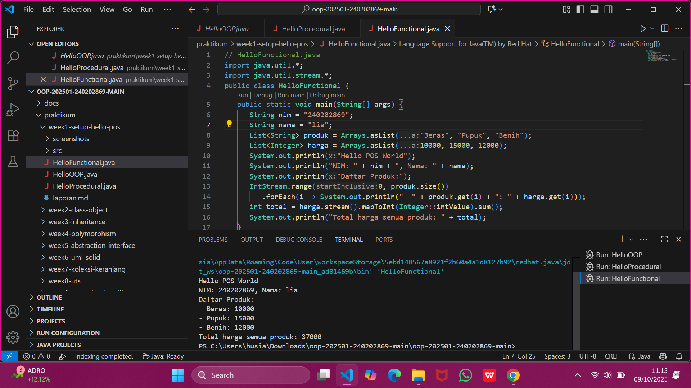

# Laporan Praktikum Minggu 1 
Topik: [Pengenalan Paradigma dan Setup Proyek]

## Identitas
- Nama  : [Lia Lusianti]
- NIM   : [240202869]
- Kelas : [3IKRB]

---

## Tujuan
- Mahasiswa mampu mendefinisikan paradigma prosedural, OOP, dan fungsional.
- Mahasiswa mampu membandingkan kelebihan dan keterbatasan tiap paradigma.
- Mahasiswa mampu memberikan contoh program sederhana untuk masing-masing paradigma.
- Mahasiswa aktif dalam diskusi kelas (bertanya, menjawab, memberi opini).


---

## Dasar Teori
Paradigma pemrograman adalah cara pandang dalam menyusun program:

1. Prosedural: program dibangun sebagai rangkaian perintah (fungsi/prosedur).
2. OOP (Object-Oriented Programming): program dibangun dari objek yang memiliki data (atribut) dan perilaku (method).
3. Fungsional: program dipandang sebagai pemetaan fungsi matematika, lebih menekankan ekspresi dan transformasi data.

Dalam konteks Agri-POS, OOP membantu memodelkan entitas nyata seperti Produk, Transaksi, dan Pembayaran sebagai objek. Dengan demikian, sistem lebih mudah dikembangkan dan dipelihara.
---

## Langkah Praktikum
Setup Project

1. Pastikan sudah menginstall JDK (Java Development Kit), IDE (misal: IntelliJ IDEA, VS Code, NetBeans), Git, PostgreSQL, dan JavaFX di komputer.
2. Buat folder project oop-pos-<nim>.
3. Inisialisasi repositori Git.
4. Buat struktur awal src/main/java/com/upb/agripos/.
5. Pastikan semua tools dapat berjalan (uji dengan membuat dan menjalankan program Java sederhana).

Program Sederhana dalam 3 Paradigma

1. Prosedural: program untuk menghitung total harga dua produk.
2. OOP: class Produk dengan atribut nama dan harga, buat minimal tiga objek, lalu hitung total.
3. Fungsional: gunakan Stream atau lambda untuk menghitung total harga dari minimal tiga objek.
Commit dan Push

1. Commit dengan pesan: week1-setup-hello-pos.
---

## Kode Program

Procedural
```java
// HelloProcedural.java
public class HelloProcedural {
   public static void main(String[] args) {
      String nim = "240202869";
      String nama = "liaaa";
      String[] produk = {"Beras", "Pupuk", "Benih"};
      int[] harga = {10000, 15000, 12000};
      int total = 0;
      System.out.println("Hello POS World");
      System.out.println("NIM: " + nim + ", Nama: " + nama);
      System.out.println("Daftar Produk:");
      for (int i = 0; i < produk.length; i++) {
         System.out.println("- " + produk[i] + ": " + harga[i]);
         total += harga[i];
      }
      System.out.println("Total harga semua produk: " + total);
   }
}
```
OOP
```java
// HelloOOP.java
class Produk {
   String nama;
   int harga;
   Produk(String nama, int harga) {
      this.nama = nama;
      this.harga = harga;
   }
}

public class HelloOOP {
   public static void main(String[] args) {
      String nim = "240202869";
      String namaMhs = "liaaa";
      Produk[] daftar = {
         new Produk("Beras", 10000),
         new Produk("Pupuk", 15000),
         new Produk("Benih", 12000)
      };
      int total = 0;
      System.out.println("Hello POS World");
      System.out.println("NIM: " + nim + ", Nama: " + namaMhs);
      System.out.println("Daftar Produk:");
      for (Produk p : daftar) {
         System.out.println("- " + p.nama + ": " + p.harga);
         total += p.harga;
      }
      System.out.println("Total harga semua produk: " + total);
   }
}
```
Functional 

```java 
// HelloFunctional.java
import java.util.*;
import java.util.stream.*;
public class HelloFunctional {
   public static void main(String[] args) {
      String nim = "240202869";
      String nama = "liaaa";
      List<String> produk = Arrays.asList("Beras", "Pupuk", "Benih");
      List<Integer> harga = Arrays.asList(10000, 15000, 12000);
      System.out.println("Hello POS World");
      System.out.println("NIM: " + nim + ", Nama: " + nama);
      System.out.println("Daftar Produk:");
      IntStream.range(0, produk.size())
         .forEach(i -> System.out.println("- " + produk.get(i) + ": " + harga.get(i)));
      int total = harga.stream().mapToInt(Integer::intValue).sum();
      System.out.println("Total harga semua produk: " + total);
   }
}
```
---

## Hasil Eksekusi



---

## Analisis
- Minggu 1 membahas tiga cara pemrograman: prosedural, OOP, dan fungsional.
- Prosedural: pakai array + loop.
- OOP: pakai class dan objek.
- Fungsional: pakai lambda + Stream API.
- Minggu 1 masih dasar, belum OOP lanjutan.
- Minggu berikutnya lebih kompleks karena sudah pakai konsep OOP penuh.
- Kendala umum: struktur folder, package error, IDE tidak mengenali file, dan masalah Git.
---

## Kesimpulan
*Paradigma prosedural cocok untuk program sederhana, OOP membuat struktur program lebih terorganisir dan mudah dikembangkan, sedangkan paradigma fungsional membantu menghasilkan kode yang lebih ringkas dan minim kesalahan. Dengan mempraktikkan ketiga pendekatan ini pada studi kasus sederhana, mahasiswa dapat melihat bagaimana pemilihan paradigma berpengaruh pada kemudahan pengembangan, maintainability, serta scalability suatu aplikasi—khususnya bahwa OOP paling sesuai untuk membangun sistem POS karena mampu memodelkan objek dunia nyata dengan lebih efektif.*

---

## Quiz
1. Apakah OOP selalu lebih baik dari prosedural? **Jawaban**:OOP lebih baik untuk aplikasi besar dan kompleks, tetapi prosedural lebih cepat, sederhana, dan cocok untuk program kecil atau tugas yang tidak butuh banyak struktur.

2. Kapan functional programming lebih cocok digunakan dibanding OOP atau prosedural? **Jawaban**:Paradigma fungsional cocok ketika kita perlu pengolahan data yang intensif, perhitungan matematis, atau operasi yang bisa diparalelkan seperti filtering, mapping, dan data transformation.

3. Bagaimana paradigma (prosedural, OOP, fungsional) memengaruhi maintainability dan scalability aplikasi? **Jawaban**:- Prosedural: mudah di awal, tapi makin besar program, makin sulit dipelihara - OOP: lebih terstruktur, mudah dikembangkan dan diperluas, sehingga lebih scalable. -Fungsional: kode lebih singkat dan minim bug, cocok untuk aplikasi skala besar berbasis data.

4. Mengapa OOP lebih cocok untuk mengembangkan aplikasi POS dibanding prosedural? **Jawaban**:Karena POS memiliki banyak entitas nyata (Produk, Kasir, Transaksi). OOP memudahkan modeling objek tersebut sehingga fitur lebih mudah ditambah, dipelihara, dan diperluas.

5. Bagaimana paradigma fungsional dapat membantu mengurangi kode berulang (boilerplate code)? **Jawaban**:Dengan fitur seperti lambda, Stream API, dan fungsi higher-order, proses looping atau pengolahan data bisa dibuat dalam 1–2 baris, sehingga kode lebih ringkas dan tidak repetitif.

