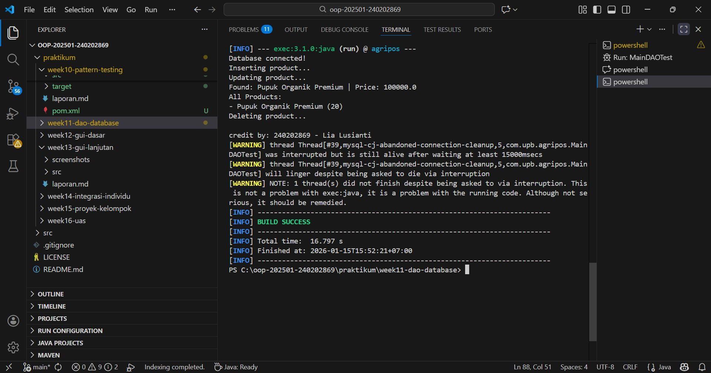

# Laporan Praktikum Minggu 11
Topik: [Data Access Object (DAO) dan CRUD Database dengan JDBC]

## Identitas
- Nama  : [Lia Lusianti]
- NIM   : [240202869]
- Kelas : [3IKRB]

---

## Tujuan
- Menjelaskan konsep Data Access Object (DAO) dalam pengembangan aplikasi OOP.
- Menghubungkan aplikasi Java dengan basis data menggunakan JDBC.
- Mengimplementasikan operasi CRUD (Create, Read, Update, Delete) secara lengkap.
- Mengintegrasikan DAO dengan class aplikasi OOP sesuai prinsip desain yang baik.

---

## Dasar Teori
1. Konsep Data Access Object (DAO)
DAO adalah pola desain yang memisahkan logika akses data dari logika bisnis aplikasi. Dengan DAO, perubahan teknologi basis data tidak memengaruhi logika utama aplikasi.

Manfaat DAO:
- Kode lebih terstruktur dan mudah dipelihara
- Mengurangi tight coupling antara aplikasi dan database
- Mendukung pengujian dan pengembangan lanjutan
2. JDBC dan Koneksi Database
JDBC (Java Database Connectivity) digunakan untuk menghubungkan aplikasi Java dengan basis data relasional, dalam praktikum ini menggunakan PostgreSQL.

Komponen utama JDBC:
- DriverManager
- Connection
- PreparedStatement
- ResultSet
---

## Kode Program
ProductDAO
```java
package com.upb.agripos.dao;

import java.util.List;

import com.upb.agripos.model.Product;

public interface ProductDAO {
    void insert(Product product) throws Exception;
    Product findByCode(String code) throws Exception;
    List<Product> findAll() throws Exception;
    void update(Product product) throws Exception;
    void delete(String code) throws Exception;
}
```
ProductDAOImpl
```java 
package com.upb.agripos.dao;

import java.sql.Connection;
import java.sql.PreparedStatement;
import java.sql.ResultSet;
import java.util.ArrayList;
import java.util.List;

import com.upb.agripos.model.Product;

public class ProductDAOImpl implements ProductDAO {

    private final Connection connection;

    public ProductDAOImpl(Connection connection) {
        this.connection = connection;
    }

    @Override
    public void insert(Product p) throws Exception {
        String sql = "INSERT INTO products(code, name, price, stock) VALUES (?, ?, ?, ?)";
        try (PreparedStatement ps = connection.prepareStatement(sql)) {
            ps.setString(1, p.getCode());
            ps.setString(2, p.getName());
            ps.setDouble(3, p.getPrice());
            ps.setInt(4, p.getStock());
            ps.executeUpdate();
        }
    }

    @Override
    public Product findByCode(String code) throws Exception {
        String sql = "SELECT * FROM products WHERE code = ?";
        try (PreparedStatement ps = connection.prepareStatement(sql)) {
            ps.setString(1, code);
            try (ResultSet rs = ps.executeQuery()) {
                if (rs.next()) {
                    return new Product(
                        rs.getString("code"),
                        rs.getString("name"),
                        rs.getDouble("price"),
                        rs.getInt("stock")
                    );
                }
            }
        }
        return null;
    }

    @Override
    public List<Product> findAll() throws Exception {
        List<Product> list = new ArrayList<>();
        String sql = "SELECT * FROM products";
        try (PreparedStatement ps = connection.prepareStatement(sql);
             ResultSet rs = ps.executeQuery()) {
            while (rs.next()) {
                list.add(new Product(
                    rs.getString("code"),
                    rs.getString("name"),
                    rs.getDouble("price"),
                    rs.getInt("stock")
                ));
            }
        }
        return list;
    }

    @Override
    public void update(Product p) throws Exception {
        String sql = "UPDATE products SET name=?, price=?, stock=? WHERE code=?";
        try (PreparedStatement ps = connection.prepareStatement(sql)) {
            ps.setString(1, p.getName());
            ps.setDouble(2, p.getPrice());
            ps.setInt(3, p.getStock());
            ps.setString(4, p.getCode());
            ps.executeUpdate();
        }
    }

    @Override
    public void delete(String code) throws Exception {
        String sql = "DELETE FROM products WHERE code=?";
        try (PreparedStatement ps = connection.prepareStatement(sql)) {
            ps.setString(1, code);
            ps.executeUpdate();
        }
    }
}
```
Product
```java 
package com.upb.agripos.model;

public class Product {
    private String code;
    private String name;
    private double price;
    private int stock;

    public Product(String code, String name, double price, int stock) {
        this.code = code;
        this.name = name;
        this.price = price;
        this.stock = stock;
    }

    public String getCode() { return code; }
    public String getName() { return name; }
    public double getPrice() { return price; }
    public int getStock() { return stock; }

    public void setName(String name) { this.name = name; }
    public void setPrice(double price) { this.price = price; }
    public void setStock(int stock) { this.stock = stock; }
}
```
MainDAO
```java 
package com.upb.agripos.model;

public class Product {
    private String code;
    private String name;
    private double price;
    private int stock;

    public Product(String code, String name, double price, int stock) {
        this.code = code;
        this.name = name;
        this.price = price;
        this.stock = stock;
    }

    public String getCode() { return code; }
    public String getName() { return name; }
    public double getPrice() { return price; }
    public int getStock() { return stock; }

    public void setName(String name) { this.name = name; }
    public void setPrice(double price) { this.price = price; }
    public void setStock(int stock) { this.stock = stock; }
}
```
---

## Hasil Eksekusi


.png)

---

## Analisis
- Program menerapkan pola desain Data Access Object (DAO) untuk memisahkan logika akses data dan logika aplikasi.
- Interface ProductDAO mendefinisikan operasi CRUD, sedangkan ProductDAOImpl mengimplementasikannya menggunakan JDBC.
- Class Product berfungsi sebagai model data yang merepresentasikan tabel produk di database.
- Perbedaan dengan minggu sebelumnya adalah penggunaan DAO, sehingga struktur program lebih modular, rapi, dan mudah dikembangkan.
- Kendala yang dihadapi berupa kesalahan koneksi database dan query SQL, yang diatasi dengan pengecekan konfigurasi JDBC dan struktur tabel database.

---

## Kesimpulan
- Penerapan DAO dan JDBC membuat program lebih terstruktur dan mudah dipelihara.
- Operasi CRUD dapat diimplementasikan dengan lebih rapi dan efisien.
- Pendekatan ini meningkatkan kualitas desain program berbasis Object-Oriented Programming (OOP).

---
