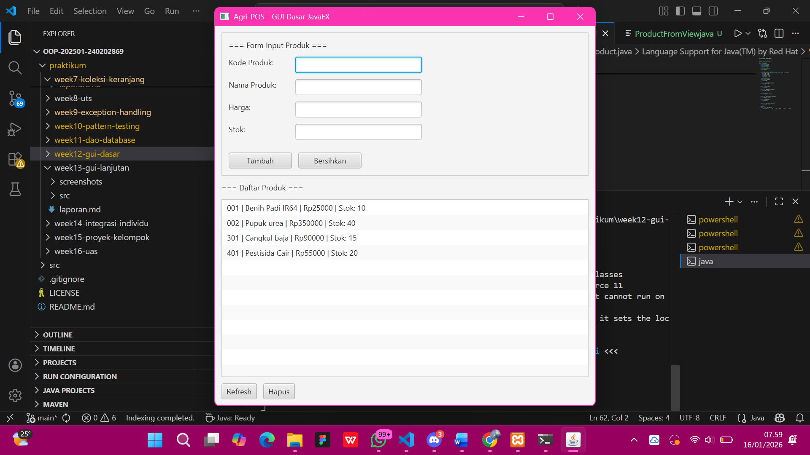

# Laporan Praktikum Minggu 12 
Topik: [GUI Dasar JavaFX (Event-Driven Programming)]

## Identitas
- Nama  : [Lia Lusianti]
- NIM   : [240202869]
- Kelas : [3IKRB]

---

## Tujuan
- Menjelaskan konsep event-driven programming.
- Membangun antarmuka grafis sederhana menggunakan JavaFX.
- Membuat form input data produk.
- Menampilkan daftar produk pada GUI.
- Mengintegrasikan GUI dengan modul backend yang telah dibuat (DAO & Service).

---

## Kode Program

DatabaseConfig
```java
package com.upb.agripos.config;

import java.sql.Connection;
import java.sql.DriverManager;
import java.sql.SQLException;

/**
 * DatabaseConfig - Singleton pattern untuk mengelola koneksi database
 */
public class DatabaseConfig {
    private static final String DB_URL = "jdbc:mysql://localhost:3306/agripos";
    private static final String DB_USER = "root";
    private static final String DB_PASSWORD = "";
    
    static {
        try {
            Class.forName("com.mysql.cj.jdbc.Driver");
        } catch (ClassNotFoundException e) {
            System.err.println("MySQL JDBC Driver not found!");
            e.printStackTrace();
        }
    }
    
    public static Connection getConnection() throws SQLException {
        return DriverManager.getConnection(DB_URL, DB_USER, DB_PASSWORD);
    }
    
    public static void closeConnection(Connection connection) {
        if (connection != null) {
            try {
                connection.close();
            } catch (SQLException e) {
                System.err.println("Error closing connection: " + e.getMessage());
            }
        }
    }
}
```
ProductController
```java 
package com.upb.agripos.controller;

import com.upb.agripos.model.Product;
import com.upb.agripos.service.ProductService;

import javafx.collections.FXCollections;
import javafx.collections.ObservableList;

/**
 * ProductController - Menghubungkan View dengan Service
 * Sesuai dengan Sequence Diagram Bab 6
 */
public class ProductController {
    private ProductService productService;
    private ObservableList<Product> productList;

    public ProductController(ProductService productService) {
        this.productService = productService;
        this.productList = FXCollections.observableArrayList();
        loadProducts();
    }

    /**
     * Tambah produk baru
     * Dipanggil oleh event handler tombol Tambah
     */
    public String addProduct(String code, String name, String priceStr, String stockStr) {
        try {
            // Parse input
            double price = Double.parseDouble(priceStr);
            int stock = Integer.parseInt(stockStr);

            // Buat objek Product
            Product product = new Product(code, name, price, stock);

            // Panggil service (yang akan memanggil DAO)
            boolean success = productService.insert(product);

            if (success) {
                productList.add(product);
                return "Produk berhasil ditambahkan!";
            } else {
                return "Gagal menambahkan produk ke database";
            }
        } catch (NumberFormatException e) {
            return "Error: Harga dan Stok harus berupa angka";
        } catch (IllegalArgumentException e) {
            return "Error: " + e.getMessage();
        } catch (Exception e) {
            return "Error: " + e.getMessage();
        }
    }

    /**
     * Load semua produk dari database
     */
    public void loadProducts() {
        productList.clear();
        productList.addAll(productService.getAllProducts());
    }

    /**
     * Get observable list untuk binding ke UI
     */
    public ObservableList<Product> getProductList() {
        return productList;
    }

    /**
     * Hapus produk berdasarkan kode
     */
    public String deleteProduct(String code) {
        try {
            boolean success = productService.delete(code);
            if (success) {
                // Hapus dari observable list
                productList.removeIf(p -> p.getCode().equals(code));
                return "Produk berhasil dihapus!";
            } else {
                return "Gagal menghapus produk dari database";
            }
        } catch (Exception e) {
            return "Error: " + e.getMessage();
        }
    }

    /**
     * Refresh data dari database
     */
    public void refreshProducts() {
        loadProducts();
    }
}
```

ProductDAO
```java
package com.upb.agripos.dao;

import com.upb.agripos.model.Product;
import java.sql.*;
import java.util.ArrayList;
import java.util.List;

/**
 * ProductDAO - Data Access Object untuk Product
 * Menggunakan PostgreSQL (dari Pertemuan 11)
 */
public class ProductDAO {
    private Connection connection;

    public ProductDAO(Connection connection) {
        this.connection = connection;
    }

    /**
     * Insert produk baru ke database
     */
    public boolean insert(Product product) {
        String sql = "INSERT INTO products (code, name, price, stock) VALUES (?, ?, ?, ?)";
        try (PreparedStatement stmt = connection.prepareStatement(sql)) {
            stmt.setString(1, product.getCode());
            stmt.setString(2, product.getName());
            stmt.setDouble(3, product.getPrice());
            stmt.setInt(4, product.getStock());
            
            int rowsAffected = stmt.executeUpdate();
            return rowsAffected > 0;
        } catch (SQLException e) {
            System.err.println("Error insert product: " + e.getMessage());
            return false;
        }
    }

    /**
     * Ambil semua produk dari database
     */
    public List<Product> findAll() {
        List<Product> products = new ArrayList<>();
        String sql = "SELECT code, name, price, stock FROM products";
        
        try (Statement stmt = connection.createStatement();
             ResultSet rs = stmt.executeQuery(sql)) {
            
            while (rs.next()) {
                Product p = new Product(
                    rs.getString("code"),
                    rs.getString("name"),
                    rs.getDouble("price"),
                    rs.getInt("stock")
                );
                products.add(p);
            }
        } catch (SQLException e) {
            System.err.println("Error findAll products: " + e.getMessage());
        }
        
        return products;
    }

    /**
     * Cari produk berdasarkan kode
     */
    public Product findByCode(String code) {
        String sql = "SELECT code, name, price, stock FROM products WHERE code = ?";
        try (PreparedStatement stmt = connection.prepareStatement(sql)) {
            stmt.setString(1, code);
            ResultSet rs = stmt.executeQuery();
            
            if (rs.next()) {
                return new Product(
                    rs.getString("code"),
                    rs.getString("name"),
                    rs.getDouble("price"),
                    rs.getInt("stock")
                );
            }
        } catch (SQLException e) {
            System.err.println("Error findByCode: " + e.getMessage());
        }
        return null;
    }

    /**
     * Update produk
     */
    public boolean update(Product product) {
        String sql = "UPDATE products SET name = ?, price = ?, stock = ? WHERE code = ?";
        try (PreparedStatement stmt = connection.prepareStatement(sql)) {
            stmt.setString(1, product.getName());
            stmt.setDouble(2, product.getPrice());
            stmt.setInt(3, product.getStock());
            stmt.setString(4, product.getCode());
            
            return stmt.executeUpdate() > 0;
        } catch (SQLException e) {
            System.err.println("Error update product: " + e.getMessage());
            return false;
        }
    }

    /**
     * Delete produk berdasarkan kode
     */
    public boolean delete(String code) {
        String sql = "DELETE FROM products WHERE code = ?";
        try (PreparedStatement stmt = connection.prepareStatement(sql)) {
            stmt.setString(1, code);
            return stmt.executeUpdate() > 0;
        } catch (SQLException e) {
            System.err.println("Error delete product: " + e.getMessage());
            return false;
        }
    }
}
```
Product
```java
package com.upb.agripos.model;

/**
 * Model Product untuk Agri-POS
 * Sesuai dengan desain Bab 6
 */
public class Product {
    private String code;
    private String name;
    private double price;
    private int stock;

    // Constructor kosong
    public Product() {
    }

    // Constructor dengan parameter
    public Product(String code, String name, double price, int stock) {
        this.code = code;
        this.name = name;
        this.price = price;
        this.stock = stock;
    }

    // Getters and Setters
    public String getCode() {
        return code;
    }

    public void setCode(String code) {
        this.code = code;
    }

    public String getName() {
        return name;
    }

    public void setName(String name) {
        this.name = name;
    }

    public double getPrice() {
        return price;
    }

    public void setPrice(double price) {
        this.price = price;
    }

    public int getStock() {
        return stock;
    }

    public void setStock(int stock) {
        this.stock = stock;
    }

    @Override
    public String toString() {
        return code + " - " + name + " | Rp " + price + " | Stok: " + stock;
    }
}
```
ProductService
```java
package com.upb.agripos.service;

import com.upb.agripos.dao.ProductDAO;
import com.upb.agripos.model.Product;
import java.util.List;

/**
 * ProductService - Business Logic Layer
 * Menerapkan DIP: View/Controller tidak langsung akses DAO
 */
public class ProductService {
    private ProductDAO productDAO;

    public ProductService(ProductDAO productDAO) {
        this.productDAO = productDAO;
    }

    /**
     * Tambah produk baru
     * Validasi dilakukan di sini
     */
    public boolean insert(Product product) throws IllegalArgumentException {
        // Validasi input
        if (product.getCode() == null || product.getCode().trim().isEmpty()) {
            throw new IllegalArgumentException("Kode produk tidak boleh kosong");
        }
        if (product.getName() == null || product.getName().trim().isEmpty()) {
            throw new IllegalArgumentException("Nama produk tidak boleh kosong");
        }
        if (product.getPrice() <= 0) {
            throw new IllegalArgumentException("Harga harus lebih dari 0");
        }
        if (product.getStock() < 0) {
            throw new IllegalArgumentException("Stok tidak boleh negatif");
        }

        // Cek duplikasi kode
        Product existing = productDAO.findByCode(product.getCode());
        if (existing != null) {
            throw new IllegalArgumentException("Kode produk sudah ada: " + product.getCode());
        }

        return productDAO.insert(product);
    }

    /**
     * Ambil semua produk
     */
    public List<Product> getAllProducts() {
        return productDAO.findAll();
    }

    /**
     * Cari produk berdasarkan kode
     */
    public Product getProductByCode(String code) {
        return productDAO.findByCode(code);
    }

    /**
     * Update produk
     */
    public boolean update(Product product) throws IllegalArgumentException {
        // Validasi
        if (product.getCode() == null || product.getCode().trim().isEmpty()) {
            throw new IllegalArgumentException("Kode produk tidak boleh kosong");
        }
        if (product.getName() == null || product.getName().trim().isEmpty()) {
            throw new IllegalArgumentException("Nama produk tidak boleh kosong");
        }
        if (product.getPrice() <= 0) {
            throw new IllegalArgumentException("Harga harus lebih dari 0");
        }
        if (product.getStock() < 0) {
            throw new IllegalArgumentException("Stok tidak boleh negatif");
        }

        return productDAO.update(product);
    }

    /**
     * Hapus produk
     */
    public boolean delete(String code) {
        return productDAO.delete(code);
    }
}
```
ProductFromView
```java
package com.upb.agripos.view;

import com.upb.agripos.controller.ProductController;
import com.upb.agripos.model.Product;
import javafx.geometry.Insets;
import javafx.scene.control.*;
import javafx.scene.layout.BorderPane;
import javafx.scene.layout.HBox;
import javafx.scene.layout.VBox;

import java.util.List;

/**
 * ProductFormView - View Layer dengan JavaFX
 * Menampilkan UI form produk dan daftar produk
 */
public class ProductFormView extends BorderPane {
    private ProductController controller;
    
    // Form components
    private TextField tfCode;
    private TextField tfName;
    private TextField tfPrice;
    private TextField tfStock;
    private ListView<String> lvProducts;
    
    public ProductFormView(ProductController controller) {
        this.controller = controller;
        initUI();
        refreshProductList();
    }
    
    private void initUI() {
        // Top section - Form
        VBox formBox = createFormBox();
        this.setTop(formBox);
        
        // Center section - Product List
        VBox listBox = createListBox();
        this.setCenter(listBox);
        
        this.setPadding(new Insets(10));
    }
    
    private VBox createFormBox() {
        VBox formBox = new VBox(10);
        formBox.setStyle("-fx-border-color: #cccccc; -fx-border-width: 1; -fx-padding: 10;");
        
        // Code field
        HBox codeBox = new HBox(5);
        Label lblCode = new Label("Kode Produk:");
        lblCode.setPrefWidth(100);
        tfCode = new TextField();
        tfCode.setPrefWidth(200);
        codeBox.getChildren().addAll(lblCode, tfCode);
        
        // Name field
        HBox nameBox = new HBox(5);
        Label lblName = new Label("Nama Produk:");
        lblName.setPrefWidth(100);
        tfName = new TextField();
        tfName.setPrefWidth(200);
        nameBox.getChildren().addAll(lblName, tfName);
        
        // Price field
        HBox priceBox = new HBox(5);
        Label lblPrice = new Label("Harga:");
        lblPrice.setPrefWidth(100);
        tfPrice = new TextField();
        tfPrice.setPrefWidth(200);
        priceBox.getChildren().addAll(lblPrice, tfPrice);
        
        // Stock field
        HBox stockBox = new HBox(5);
        Label lblStock = new Label("Stok:");
        lblStock.setPrefWidth(100);
        tfStock = new TextField();
        tfStock.setPrefWidth(200);
        stockBox.getChildren().addAll(lblStock, tfStock);
        
        // Buttons
        HBox buttonBox = new HBox(10);
        buttonBox.setPadding(new Insets(10, 0, 0, 0));
        
        Button btnAdd = new Button("Tambah");
        btnAdd.setPrefWidth(100);
        btnAdd.setOnAction(event -> handleAddProduct());
        
        Button btnClear = new Button("Bersihkan");
        btnClear.setPrefWidth(100);
        btnClear.setOnAction(event -> clearForm());
        
        buttonBox.getChildren().addAll(btnAdd, btnClear);
        
        formBox.getChildren().addAll(
            new Label("=== Form Input Produk ==="),
            codeBox, nameBox, priceBox, stockBox,
            buttonBox
        );
        
        return formBox;
    }
    
    private VBox createListBox() {
        VBox listBox = new VBox(10);
        listBox.setPadding(new Insets(10, 0, 0, 0));
        
        Label lblTitle = new Label("=== Daftar Produk ===");
        
        lvProducts = new ListView<>();
        lvProducts.setPrefHeight(300);
        
        HBox actionBox = new HBox(10);
        Button btnRefresh = new Button("Refresh");
        btnRefresh.setOnAction(event -> refreshProductList());
        
        Button btnDelete = new Button("Hapus");
        btnDelete.setOnAction(event -> handleDeleteProduct());
        
        actionBox.getChildren().addAll(btnRefresh, btnDelete);
        
        listBox.getChildren().addAll(lblTitle, lvProducts, actionBox);
        return listBox;
    }
    
    private void handleAddProduct() {
        try {
            String code = tfCode.getText().trim();
            String name = tfName.getText().trim();
            String price = tfPrice.getText().trim();
            String stock = tfStock.getText().trim();
            
            String result = controller.addProduct(code, name, price, stock);
            
            if (result.contains("berhasil")) {
                showAlert("Sukses", result);
                clearForm();
                refreshProductList();
            } else {
                showAlert("Gagal", result);
            }
        } catch (Exception e) {
            showAlert("Error", "Terjadi kesalahan: " + e.getMessage());
        }
    }
    
    private void handleDeleteProduct() {
        int selectedIdx = lvProducts.getSelectionModel().getSelectedIndex();
        if (selectedIdx >= 0) {
            try {
                List<Product> products = controller.getProductList();
                Product selectedProduct = products.get(selectedIdx);
                String result = controller.deleteProduct(selectedProduct.getCode());
                
                if (result.contains("berhasil")) {
                    showAlert("Sukses", result);
                    refreshProductList();
                } else {
                    showAlert("Gagal", result);
                }
            } catch (Exception e) {
                showAlert("Error", "Gagal menghapus produk: " + e.getMessage());
            }
        } else {
            showAlert("Peringatan", "Pilih produk yang akan dihapus!");
        }
    }
    
    private void refreshProductList() {
        try {
            List<Product> products = controller.getProductList();
            lvProducts.getItems().clear();
            for (Product p : products) {
                lvProducts.getItems().add(
                    String.format("%s | %s | Rp%.0f | Stok: %d", 
                        p.getCode(), p.getName(), p.getPrice(), p.getStock())
                );
            }
        } catch (Exception e) {
            showAlert("Error", "Gagal memuat data produk: " + e.getMessage());
        }
    }
    
    private void clearForm() {
        tfCode.clear();
        tfName.clear();
        tfPrice.clear();
        tfStock.clear();
        tfCode.requestFocus();
    }
    
    private void showAlert(String title, String message) {
        Alert alert = new Alert(Alert.AlertType.INFORMATION);
        alert.setTitle(title);
        alert.setContentText(message);
        alert.showAndWait();
    }
}
```
APPJavaFX
```java
package com.upb.agripos;

import java.sql.Connection;

import com.upb.agripos.config.DatabaseConfig;
import com.upb.agripos.controller.ProductController;
import com.upb.agripos.dao.ProductDAO;
import com.upb.agripos.service.ProductService;
import com.upb.agripos.view.ProductFormView;

import javafx.application.Application;
import javafx.scene.Scene;
import javafx.stage.Stage;

/**
 * AppJavaFX - Main Application
 * Menerapkan Dependency Injection untuk memenuhi SOLID (DIP)
 */
public class AppJavaFX extends Application {
    
    private Connection connection;

    @Override
    public void start(Stage primaryStage) {
        try {
            // Setup Database Connection
            connection = DatabaseConfig.getConnection();
            System.out.println("Database connected successfully!");

            // Dependency Injection (Bottom-Up)
            // DAO → Service → Controller → View
            ProductDAO productDAO = new ProductDAO(connection);
            ProductService productService = new ProductService(productDAO);
            ProductController productController = new ProductController(productService);
            
            // Create View
            ProductFormView view = new ProductFormView(productController);

            // Setup Scene and Stage
            Scene scene = new Scene(view, 600, 600);
            primaryStage.setTitle("Agri-POS - GUI Dasar JavaFX");
            primaryStage.setScene(scene);
            primaryStage.setOnCloseRequest(event -> cleanup());
            primaryStage.show();

        } catch (Exception e) {
            System.err.println("Error starting application: " + e.getMessage());
            e.printStackTrace();
        }
    }

    /**
     * Cleanup saat aplikasi ditutup
     */
    private void cleanup() {
        DatabaseConfig.closeConnection(connection);
        System.out.println("Application closed. Database connection closed.");
    }

    public static void main(String[] args) {
        launch(args);
    }
}
```

---

## Hasil Eksekusi
 


---

## Analisis
- Program berjalan dengan menerapkan konsep event-driven programming menggunakan JavaFX, di mana setiap aksi pengguna (klik tombol) memicu event handler tertentu.
- Alur program dimulai dari View → Controller → Service → DAO → Database, sehingga pemrosesan data terstruktur dan sesuai prinsip layered architecture.
- JavaFX digunakan untuk membangun antarmuka grafis berupa form input produk dan daftar produk, yang terhubung langsung dengan database melalui JDBC.
- Perbedaan dengan minggu sebelumnya terletak pada penambahan lapisan GUI (JavaFX) dan event handling, sedangkan sebelumnya hanya berfokus pada backend dan operasi database berbasis console.
- Kendala yang dihadapi meliputi kesalahan konfigurasi JavaFX, koneksi database, serta error parsing input. Kendala diatasi dengan pengecekan library JavaFX, pengaturan environment, serta validasi input pada ProductService.
---

## Kesimpulan
- Implementasi GUI JavaFX berhasil meningkatkan interaksi pengguna melalui antarmuka grafis yang lebih intuitif.
- Integrasi antara GUI, Controller, Service, dan DAO membuat aplikasi lebih terstruktur, modular, dan mudah dikembangkan.
- Konsep event-driven programming mempermudah pengelolaan aksi pengguna dalam aplikasi desktop berbasis Java.
- Penerapan arsitektur berlapis mendukung prinsip OOP dan SOLID, sehingga meningkatkan kualitas desain perangkat lunak.

---

