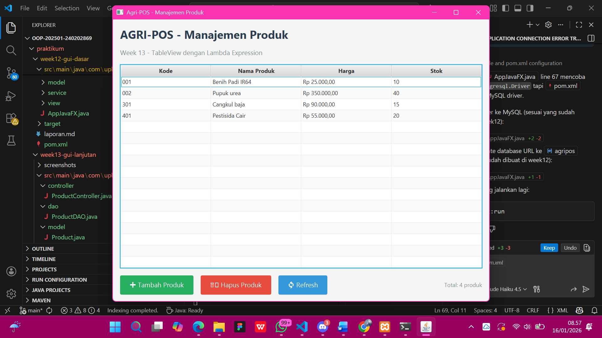
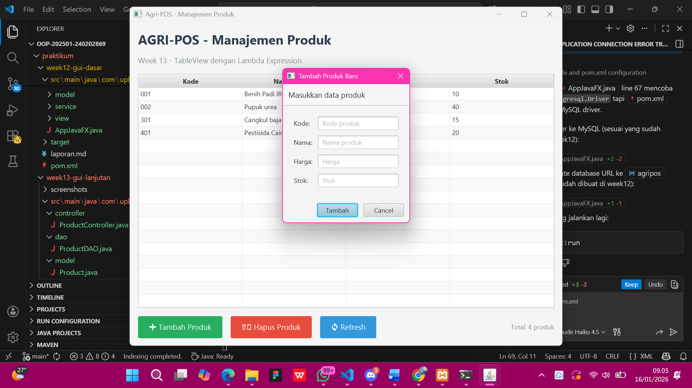
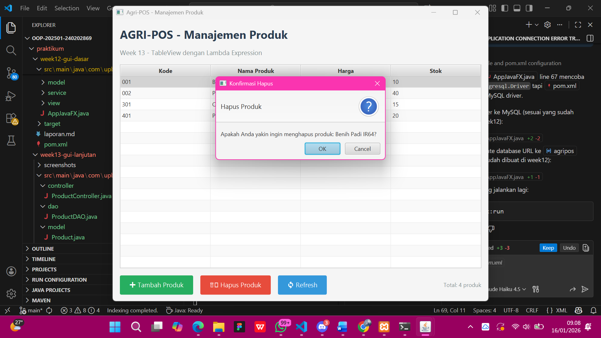

# Laporan Praktikum Minggu 13
Topik: [GUI Lanjutan JavaFX (TableView dan Lambda Expression)]

## Identitas
- Nama  : [Lia Lusianti]
- NIM   : [240202869]
- Kelas : [3IKRB]

---

## Tujuan
- Menampilkan data menggunakan TableView JavaFX.
- Mengintegrasikan koleksi objek dengan GUI.
- Menggunakan lambda expression untuk event handling.
- Menghubungkan GUI dengan DAO secara penuh.
- Membangun antarmuka GUI Agri-POS yang lebih interaktif.

---

## Kode Program
ProductController
```java
package com.upb.agripos.controller;

import com.upb.agripos.model.Product;
import com.upb.agripos.service.ProductService;
import javafx.scene.control.Alert;
import java.sql.SQLException;
import java.util.List;

/**
 * Controller untuk mengelola interaksi View dan Service
 * Sesuai Sequence Diagram: View → Controller → Service → DAO → DB
 * Week 13 - GUI Lanjutan JavaFX
 */
public class ProductController {
    private ProductService productService;

    public ProductController(ProductService productService) {
        this.productService = productService;
    }

    /**
     * Load semua produk untuk TableView
     * Sesuai UC-02 Lihat Daftar Produk
     * Dipanggil oleh View saat init dan reload
     */
    public List<Product> load() {
        try {
            return productService.findAll();
        } catch (SQLException e) {
            showError("Error Loading Data", "Gagal memuat data produk: " + e.getMessage());
            return null;
        }
    }

    /**
     * Tambah produk baru
     * Dipanggil oleh event handler tombol "Tambah Produk"
     */
    public boolean addProduct(String code, String name, String priceStr, String stockStr) {
        try {
            // Parse input
            double price = Double.parseDouble(priceStr);
            int stock = Integer.parseInt(stockStr);
            
            // Buat objek Product
            Product product = new Product(code, name, price, stock);
            
            // Panggil service
            productService.addProduct(product);
            
            showInfo("Sukses", "Produk berhasil ditambahkan");
            return true;
            
        } catch (NumberFormatException e) {
            showError("Input Error", "Harga dan stok harus berupa angka");
            return false;
        } catch (IllegalArgumentException e) {
            showError("Validasi Error", e.getMessage());
            return false;
        } catch (SQLException e) {
            showError("Database Error", "Gagal menambah produk: " + e.getMessage());
            return false;
        }
    }

    /**
     * Hapus produk
     * Sesuai UC-03 Hapus Produk dan Sequence Diagram SD-02
     * Dipanggil oleh event handler tombol "Hapus Produk"
     */
    public boolean delete(String code) {
        try {
            productService.delete(code);
            showInfo("Sukses", "Produk berhasil dihapus");
            return true;
            
        } catch (IllegalArgumentException e) {
            showError("Validasi Error", e.getMessage());
            return false;
        } catch (SQLException e) {
            showError("Database Error", "Gagal menghapus produk: " + e.getMessage());
            return false;
        }
    }

    /**
     * Update produk
     */
    public boolean update(Product product) {
        try {
            productService.update(product);
            showInfo("Sukses", "Produk berhasil diupdate");
            return true;
            
        } catch (IllegalArgumentException e) {
            showError("Validasi Error", e.getMessage());
            return false;
        } catch (SQLException e) {
            showError("Database Error", "Gagal mengupdate produk: " + e.getMessage());
            return false;
        }
    }

    /**
     * Tampilkan pesan error
     */
    private void showError(String title, String message) {
        Alert alert = new Alert(Alert.AlertType.ERROR);
        alert.setTitle(title);
        alert.setHeaderText(null);
        alert.setContentText(message);
        alert.showAndWait();
    }

    /**
     * Tampilkan pesan info
     */
    private void showInfo(String title, String message) {
        Alert alert = new Alert(Alert.AlertType.INFORMATION);
        alert.setTitle(title);
        alert.setHeaderText(null);
        alert.setContentText(message);
        alert.showAndWait();
    }
}
```
ProductDAO
```java
package com.upb.agripos.dao;

import com.upb.agripos.model.Product;
import java.sql.*;
import java.util.ArrayList;
import java.util.List;

/**
 * DAO untuk operasi database produk
 * Week 13 - GUI Lanjutan JavaFX
 */
public class ProductDAO {
    private Connection connection;

    public ProductDAO(Connection connection) {
        this.connection = connection;
    }

    /**
     * Membuat tabel products jika belum ada
     */
    public void createTable() throws SQLException {
        String sql = "CREATE TABLE IF NOT EXISTS products (" +
                "code VARCHAR(50) PRIMARY KEY, " +
                "name VARCHAR(100) NOT NULL, " +
                "price DECIMAL(10,2) NOT NULL, " +
                "stock INTEGER NOT NULL)";
        
        try (Statement stmt = connection.createStatement()) {
            stmt.execute(sql);
        }
    }

    /**
     * Menambahkan produk baru
     */
    public void insert(Product product) throws SQLException {
        String sql = "INSERT INTO products (code, name, price, stock) VALUES (?, ?, ?, ?)";
        
        try (PreparedStatement pstmt = connection.prepareStatement(sql)) {
            pstmt.setString(1, product.getCode());
            pstmt.setString(2, product.getName());
            pstmt.setDouble(3, product.getPrice());
            pstmt.setInt(4, product.getStock());
            pstmt.executeUpdate();
        }
    }

    /**
     * Mengambil semua produk dari database
     * Digunakan untuk mengisi TableView
     */
    public List<Product> findAll() throws SQLException {
        List<Product> products = new ArrayList<>();
        String sql = "SELECT * FROM products ORDER BY code";
        
        try (Statement stmt = connection.createStatement();
             ResultSet rs = stmt.executeQuery(sql)) {
            
            while (rs.next()) {
                Product product = new Product();
                product.setCode(rs.getString("code"));
                product.setName(rs.getString("name"));
                product.setPrice(rs.getDouble("price"));
                product.setStock(rs.getInt("stock"));
                products.add(product);
            }
        }
        
        return products;
    }

    /**
     * Mencari produk berdasarkan kode
     */
    public Product findByCode(String code) throws SQLException {
        String sql = "SELECT * FROM products WHERE code = ?";
        
        try (PreparedStatement pstmt = connection.prepareStatement(sql)) {
            pstmt.setString(1, code);
            
            try (ResultSet rs = pstmt.executeQuery()) {
                if (rs.next()) {
                    Product product = new Product();
                    product.setCode(rs.getString("code"));
                    product.setName(rs.getString("name"));
                    product.setPrice(rs.getDouble("price"));
                    product.setStock(rs.getInt("stock"));
                    return product;
                }
            }
        }
        
        return null;
    }

    /**
     * Update produk
     */
    public void update(Product product) throws SQLException {
        String sql = "UPDATE products SET name = ?, price = ?, stock = ? WHERE code = ?";
        
        try (PreparedStatement pstmt = connection.prepareStatement(sql)) {
            pstmt.setString(1, product.getName());
            pstmt.setDouble(2, product.getPrice());
            pstmt.setInt(3, product.getStock());
            pstmt.setString(4, product.getCode());
            pstmt.executeUpdate();
        }
    }

    /**
     * Menghapus produk berdasarkan kode
     * Sesuai UC-03 Hapus Produk
     */
    public void delete(String code) throws SQLException {
        String sql = "DELETE FROM products WHERE code = ?";
        
        try (PreparedStatement pstmt = connection.prepareStatement(sql)) {
            pstmt.setString(1, code);
            pstmt.executeUpdate();
        }
    }

    /**
     * Menghitung jumlah produk
     */
    public int count() throws SQLException {
        String sql = "SELECT COUNT(*) FROM products";
        
        try (Statement stmt = connection.createStatement();
             ResultSet rs = stmt.executeQuery(sql)) {
            
            if (rs.next()) {
                return rs.getInt(1);
            }
        }
        
        return 0;
    }
}
```
Product
```java
package com.upb.agripos.model;

/**
 * Model class untuk produk Agri-POS
 * Week 13 - GUI Lanjutan JavaFX
 */
public class Product {
    private String code;
    private String name;
    private double price;
    private int stock;

    // Constructor
    public Product() {
    }

    public Product(String code, String name, double price, int stock) {
        this.code = code;
        this.name = name;
        this.price = price;
        this.stock = stock;
    }

    // Getters and Setters
    public String getCode() {
        return code;
    }

    public void setCode(String code) {
        this.code = code;
    }

    public String getName() {
        return name;
    }

    public void setName(String name) {
        this.name = name;
    }

    public double getPrice() {
        return price;
    }

    public void setPrice(double price) {
        this.price = price;
    }

    public int getStock() {
        return stock;
    }

    public void setStock(int stock) {
        this.stock = stock;
    }

    @Override
    public String toString() {
        return "Product{" +
                "code='" + code + '\'' +
                ", name='" + name + '\'' +
                ", price=" + price +
                ", stock=" + stock +
                '}';
    }
}
```
ProductService 
```java 
package com.upb.agripos.service;

import com.upb.agripos.dao.ProductDAO;
import com.upb.agripos.model.Product;
import java.sql.SQLException;
import java.util.List;

/**
 * Service layer untuk logika bisnis produk
 * Menerapkan DIP: View tidak langsung akses DAO
 * Week 13 - GUI Lanjutan JavaFX
 */
public class ProductService {
    private ProductDAO productDAO;

    public ProductService(ProductDAO productDAO) {
        this.productDAO = productDAO;
    }

    /**
     * Mengambil semua produk
     * Dipanggil oleh Controller untuk mengisi TableView
     * Sesuai UC-02 Lihat Daftar Produk
     */
    public List<Product> findAll() throws SQLException {
        return productDAO.findAll();
    }

    /**
     * Menambah produk baru
     * Validasi dilakukan di layer ini
     */
    public void addProduct(Product product) throws SQLException {
        // Validasi input
        if (product.getCode() == null || product.getCode().trim().isEmpty()) {
            throw new IllegalArgumentException("Kode produk tidak boleh kosong");
        }
        
        if (product.getName() == null || product.getName().trim().isEmpty()) {
            throw new IllegalArgumentException("Nama produk tidak boleh kosong");
        }
        
        if (product.getPrice() <= 0) {
            throw new IllegalArgumentException("Harga harus lebih dari 0");
        }
        
        if (product.getStock() < 0) {
            throw new IllegalArgumentException("Stok tidak boleh negatif");
        }
        
        // Cek apakah kode sudah ada
        Product existing = productDAO.findByCode(product.getCode());
        if (existing != null) {
            throw new IllegalArgumentException("Kode produk sudah digunakan");
        }
        
        productDAO.insert(product);
    }

    /**
     * Menghapus produk berdasarkan kode
     * Sesuai UC-03 Hapus Produk
     */
    public void delete(String code) throws SQLException {
        if (code == null || code.trim().isEmpty()) {
            throw new IllegalArgumentException("Kode produk tidak boleh kosong");
        }
        
        // Cek apakah produk ada
        Product product = productDAO.findByCode(code);
        if (product == null) {
            throw new IllegalArgumentException("Produk tidak ditemukan");
        }
        
        productDAO.delete(code);
    }

    /**
     * Update produk
     */
    public void update(Product product) throws SQLException {
        // Validasi
        if (product.getCode() == null || product.getCode().trim().isEmpty()) {
            throw new IllegalArgumentException("Kode produk tidak boleh kosong");
        }
        
        // Cek apakah produk ada
        Product existing = productDAO.findByCode(product.getCode());
        if (existing == null) {
            throw new IllegalArgumentException("Produk tidak ditemukan");
        }
        
        productDAO.update(product);
    }

    /**
     * Cari produk berdasarkan kode
     */
    public Product findByCode(String code) throws SQLException {
        return productDAO.findByCode(code);
    }

    /**
     * Hitung total produk
     */
    public int count() throws SQLException {
        return productDAO.count();
    }
}
```
ProductTableView 
```java
package com.upb.agripos.view;

import com.upb.agripos.controller.ProductController;
import com.upb.agripos.model.Product;
import javafx.collections.FXCollections;
import javafx.collections.ObservableList;
import javafx.geometry.Insets;
import javafx.geometry.Pos;
import javafx.scene.Scene;
import javafx.scene.control.*;
import javafx.scene.control.cell.PropertyValueFactory;
import javafx.scene.layout.*;
import javafx.stage.Stage;
import java.util.List;
import java.util.Optional;

/**
 * TableView GUI untuk menampilkan dan mengelola produk
 * Week 13 - GUI Lanjutan JavaFX dengan Lambda Expression
 */
public class ProductTableView {
    private ProductController controller;
    private TableView<Product> tableView;
    private ObservableList<Product> productData;
    private Label infoLabel; // Tambahkan sebagai instance variable

    public ProductTableView(ProductController controller) {
        this.controller = controller;
        this.productData = FXCollections.observableArrayList();
    }

    /**
     * Membuat scene utama dengan TableView
     */
    public Scene createScene() {
        // Root layout
        BorderPane root = new BorderPane();
        root.setPadding(new Insets(15));
        root.setStyle("-fx-background-color: #f5f5f5;");

        // Header
        VBox header = createHeader();
        root.setTop(header);

        // TableView
        tableView = createTableView();
        root.setCenter(tableView);

        // Button panel
        HBox buttonPanel = createButtonPanel();
        root.setBottom(buttonPanel);

        // Load data awal (UC-02 Lihat Daftar Produk)
        loadData();

        return new Scene(root, 800, 600);
    }

    /**
     * Membuat header aplikasi
     */
    private VBox createHeader() {
        VBox header = new VBox(10);
        header.setPadding(new Insets(0, 0, 15, 0));

        Label title = new Label("AGRI-POS - Manajemen Produk");
        title.setStyle("-fx-font-size: 24px; -fx-font-weight: bold; -fx-text-fill: #2c3e50;");

        Label subtitle = new Label("Week 13 - TableView dengan Lambda Expression");
        subtitle.setStyle("-fx-font-size: 14px; -fx-text-fill: #7f8c8d;");

        header.getChildren().addAll(title, subtitle);
        return header;
    }

    /**
     * Membuat TableView dengan kolom-kolom sesuai spesifikasi
     */
    @SuppressWarnings("unchecked")
    private TableView<Product> createTableView() {
        TableView<Product> table = new TableView<>();
        table.setItems(productData);
        table.setColumnResizePolicy(TableView.CONSTRAINED_RESIZE_POLICY);

        // Kolom Kode
        TableColumn<Product, String> codeCol = new TableColumn<>("Kode");
        codeCol.setCellValueFactory(new PropertyValueFactory<>("code"));
        codeCol.setPrefWidth(100);

        // Kolom Nama
        TableColumn<Product, String> nameCol = new TableColumn<>("Nama Produk");
        nameCol.setCellValueFactory(new PropertyValueFactory<>("name"));
        nameCol.setPrefWidth(300);

        // Kolom Harga
        TableColumn<Product, Double> priceCol = new TableColumn<>("Harga");
        priceCol.setCellValueFactory(new PropertyValueFactory<>("price"));
        priceCol.setPrefWidth(150);
        
        // Format harga dengan currency
        priceCol.setCellFactory(col -> new TableCell<Product, Double>() {
            @Override
            protected void updateItem(Double price, boolean empty) {
                super.updateItem(price, empty);
                if (empty || price == null) {
                    setText(null);
                } else {
                    setText(String.format("Rp %,.2f", price));
                }
            }
        });

        // Kolom Stok
        TableColumn<Product, Integer> stockCol = new TableColumn<>("Stok");
        stockCol.setCellValueFactory(new PropertyValueFactory<>("stock"));
        stockCol.setPrefWidth(100);

        table.getColumns().addAll(codeCol, nameCol, priceCol, stockCol);

        return table;
    }

    /**
     * Membuat panel tombol dengan Lambda Expression
     */
    private HBox createButtonPanel() {
        HBox buttonPanel = new HBox(15);
        buttonPanel.setPadding(new Insets(15, 0, 0, 0));
        buttonPanel.setAlignment(Pos.CENTER_LEFT);

        // Tombol Tambah Produk (Lambda Expression)
        Button btnAdd = new Button("➕ Tambah Produk");
        btnAdd.setStyle("-fx-background-color: #27ae60; -fx-text-fill: white; " +
                       "-fx-font-size: 14px; -fx-padding: 10 20;");
        btnAdd.setOnAction(e -> showAddProductDialog());

        // Tombol Hapus Produk (Lambda Expression)
        // Sesuai UC-03 Hapus Produk dan SD-02
        Button btnDelete = new Button("🗑️ Hapus Produk");
        btnDelete.setStyle("-fx-background-color: #e74c3c; -fx-text-fill: white; " +
                          "-fx-font-size: 14px; -fx-padding: 10 20;");
        btnDelete.setOnAction(e -> {
            Product selected = tableView.getSelectionModel().getSelectedItem();
            if (selected != null) {
                // Konfirmasi penghapusan
                Alert confirm = new Alert(Alert.AlertType.CONFIRMATION);
                confirm.setTitle("Konfirmasi Hapus");
                confirm.setHeaderText("Hapus Produk");
                confirm.setContentText("Apakah Anda yakin ingin menghapus produk: " + 
                                      selected.getName() + "?");
                
                Optional<ButtonType> result = confirm.showAndWait();
                if (result.isPresent() && result.get() == ButtonType.OK) {
                    // Panggil controller untuk hapus (sesuai sequence diagram)
                    if (controller.delete(selected.getCode())) {
                        loadData(); // Reload data dari database
                    }
                }
            } else {
                showWarning("Tidak Ada Pilihan", "Silakan pilih produk yang ingin dihapus");
            }
        });

        // Tombol Refresh (Lambda Expression)
        Button btnRefresh = new Button("🔄 Refresh");
        btnRefresh.setStyle("-fx-background-color: #3498db; -fx-text-fill: white; " +
                           "-fx-font-size: 14px; -fx-padding: 10 20;");
        btnRefresh.setOnAction(e -> loadData());

        // Label info
        infoLabel = new Label("Total: 0 produk");
        infoLabel.setStyle("-fx-font-size: 12px; -fx-text-fill: #7f8c8d;");

        // Spacer
        Region spacer = new Region();
        HBox.setHgrow(spacer, Priority.ALWAYS);

        buttonPanel.getChildren().addAll(btnAdd, btnDelete, btnRefresh, spacer, infoLabel);

        return buttonPanel;
    }

    /**
     * Load data dari database via Controller
     * Sesuai UC-02 Lihat Daftar Produk
     * Alur: View → Controller → Service → DAO → DB
     */
    private void loadData() {
        List<Product> products = controller.load();
        if (products != null) {
            productData.clear();
            productData.addAll(products);
            // Update info label
            infoLabel.setText("Total: " + productData.size() + " produk");
        }
    }

    /**
     * Dialog untuk menambah produk baru
     */
    private void showAddProductDialog() {
        Dialog<Product> dialog = new Dialog<>();
        dialog.setTitle("Tambah Produk Baru");
        dialog.setHeaderText("Masukkan data produk");

        // Set tombol
        ButtonType addButtonType = new ButtonType("Tambah", ButtonBar.ButtonData.OK_DONE);
        dialog.getDialogPane().getButtonTypes().addAll(addButtonType, ButtonType.CANCEL);

        // Form input
        GridPane grid = new GridPane();
        grid.setHgap(10);
        grid.setVgap(10);
        grid.setPadding(new Insets(20));

        TextField codeField = new TextField();
        codeField.setPromptText("Kode produk");
        
        TextField nameField = new TextField();
        nameField.setPromptText("Nama produk");
        
        TextField priceField = new TextField();
        priceField.setPromptText("Harga");
        
        TextField stockField = new TextField();
        stockField.setPromptText("Stok");

        grid.add(new Label("Kode:"), 0, 0);
        grid.add(codeField, 1, 0);
        grid.add(new Label("Nama:"), 0, 1);
        grid.add(nameField, 1, 1);
        grid.add(new Label("Harga:"), 0, 2);
        grid.add(priceField, 1, 2);
        grid.add(new Label("Stok:"), 0, 3);
        grid.add(stockField, 1, 3);

        dialog.getDialogPane().setContent(grid);

        // Convert result dengan Lambda Expression
        dialog.setResultConverter(dialogButton -> {
            if (dialogButton == addButtonType) {
                // Panggil controller untuk tambah produk
                if (controller.addProduct(
                    codeField.getText(),
                    nameField.getText(),
                    priceField.getText(),
                    stockField.getText()
                )) {
                    loadData(); // Reload data
                }
            }
            return null;
        });

        dialog.showAndWait();
    }

    /**
     * Tampilkan pesan warning
     */
    private void showWarning(String title, String message) {
        Alert alert = new Alert(Alert.AlertType.WARNING);
        alert.setTitle(title);
        alert.setHeaderText(null);
        alert.setContentText(message);
        alert.showAndWait();
    }

    /**
     * Mendapatkan stage dari scene
     */
    public void show(Stage stage) {
        stage.setScene(createScene());
        stage.setTitle("Agri-POS - Manajemen Produk");
        stage.show();
    }
}
```
AppJavaFX
```java
package com.upb.agripos;

import java.sql.Connection;
import java.sql.DriverManager;
import java.sql.SQLException;

import com.upb.agripos.controller.ProductController;
import com.upb.agripos.dao.ProductDAO;
import com.upb.agripos.service.ProductService;
import com.upb.agripos.view.ProductTableView;

import javafx.application.Application;
import javafx.stage.Stage;

/**
 * Main Application untuk Agri-POS
 * Week 13 - GUI Lanjutan JavaFX
 * 
 * Integrasi lengkap:
 * - Week 11: DAO + JDBC
 * - Week 12: GUI JavaFX Dasar
 * - Week 13: TableView + Lambda Expression
 */
public class AppJavaFX extends Application {
    
    // Konfigurasi database PostgreSQL
    private static final String DB_URL = "jdbc:mysql://localhost:3306/agripos";
    private static final String DB_USER = "root";
    private static final String DB_PASSWORD = "";
    
    private Connection connection;

    @Override
    public void start(Stage primaryStage) {
        try {
            // Inisialisasi koneksi database
            initDatabase();
            
            // Buat DAO
            ProductDAO productDAO = new ProductDAO(connection);
            productDAO.createTable(); // Buat tabel jika belum ada
            
            // Buat Service (sesuai DIP - Dependency Inversion Principle)
            ProductService productService = new ProductService(productDAO);
            
            // Buat Controller
            ProductController productController = new ProductController(productService);
            
            // Buat View (TableView)
            ProductTableView view = new ProductTableView(productController);
            
            // Tampilkan GUI
            view.show(primaryStage);
            
            System.out.println("✓ Aplikasi Agri-POS berhasil dijalankan");
            System.out.println("✓ Database terhubung: " + DB_URL);
            
        } catch (Exception e) {
            System.err.println("✗ Error saat menjalankan aplikasi:");
            e.printStackTrace();
        }
    }

    /**
     * Inisialisasi koneksi database
     */
    private void initDatabase() throws SQLException {
        try {
            Class.forName("com.mysql.cj.jdbc.Driver");
            connection = DriverManager.getConnection(DB_URL, DB_USER, DB_PASSWORD);
            System.out.println("✓ Koneksi database berhasil");
        } catch (ClassNotFoundException e) {
            throw new SQLException("MySQL JDBC Driver tidak ditemukan", e);
        }
    }

    @Override
    public void stop() {
        // Tutup koneksi database saat aplikasi ditutup
        if (connection != null) {
            try {
                connection.close();
                System.out.println("✓ Koneksi database ditutup");
            } catch (SQLException e) {
                System.err.println("✗ Error saat menutup koneksi: " + e.getMessage());
            }
        }
    }

    public static void main(String[] args) {
        launch(args);
    }
}
```
---

## Hasil Eksekusi






---

## Analisis
- Program menampilkan data produk menggunakan TableView JavaFX yang terhubung langsung dengan database melalui arsitektur View → Controller → Service → DAO → Database.
- Lambda Expression digunakan untuk menangani event tombol seperti tambah, hapus, dan refresh, sehingga kode menjadi lebih ringkas dan mudah dibaca.
- Data produk diambil dari database oleh DAO, diproses oleh Service, kemudian ditampilkan secara dinamis dalam TableView.
- Perbedaan dengan minggu sebelumnya adalah penggunaan TableView sebagai komponen utama tampilan data serta penerapan lambda expression, sehingga antarmuka menjadi lebih interaktif dan responsif.
- Kendala yang dihadapi meliputi kesalahan binding kolom TableView, error query SQL, serta sinkronisasi data setelah operasi CRUD. Kendala diatasi dengan pengecekan properti model, perbaikan query, dan pemanggilan ulang fungsi load data.
---

## Kesimpulan
- Penggunaan TableView JavaFX mempermudah penampilan data dalam bentuk tabel yang rapi dan informatif.
- Penerapan lambda expression menyederhanakan penanganan event dan meningkatkan keterbacaan kode.
- Integrasi GUI lanjutan dengan DAO dan Service menghasilkan aplikasi yang lebih interaktif, terstruktur, dan mudah dikembangkan.
- Penerapan arsitektur berlapis mendukung prinsip OOP dan SOLID, sehingga meningkatkan kualitas desain sistem Agri-POS.

---

