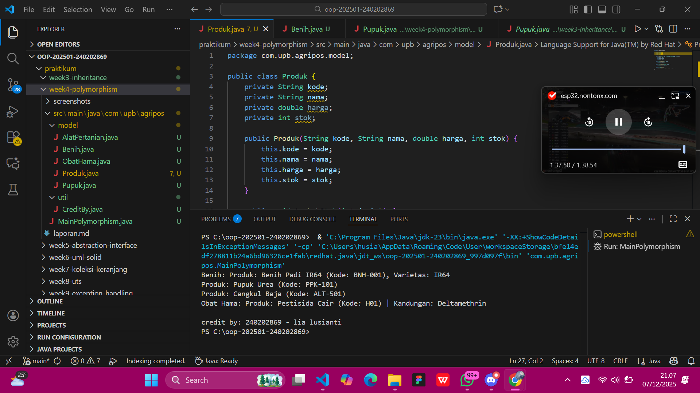

# Laporan Praktikum Minggu 4
Topik: Polymorphism (Info Produk)

## Identitas
- Nama  : [Lia Lusianti]
- NIM   : [240202869]
- Kelas : [3IKRB]

---

## Tujuan
- Mahasiswa mampu menjelaskan konsep polymorphism dalam OOP.
- Mahasiswa mampu membedakan method overloading dan overriding.
- Mahasiswa mampu mengimplementasikan polymorphism (overriding, overloading, dynamic binding) dalam program.
- Mahasiswa mampu menganalisis contoh kasus polymorphism pada sistem nyata (Agri-POS).
---

## Dasar Teori
Polymorphism berarti “banyak bentuk” dan memungkinkan objek yang berbeda merespons panggilan method yang sama dengan cara yang berbeda.

- Overloading → mendefinisikan method dengan nama sama tetapi parameter berbeda.
- Overriding → subclass mengganti implementasi method dari superclass.
- Dynamic Binding → pemanggilan method ditentukan saat runtime, bukan compile time.

Dalam konteks Agri-POS, misalnya:
- Method getInfo() pada Produk dioverride oleh Benih, Pupuk, AlatPertanian untuk menampilkan detail spesifik.
- Method tambahStok() bisa dibuat overload dengan parameter berbeda (int, double).

---

## Langkah Praktikum

1. Overloading
- Tambahkan method tambahStok(int jumlah) dan tambahStok(double jumlah) pada class Produk.
2. Overriding
- Tambahkan method getInfo() pada superclass Produk.
- Override method getInfo() pada subclass Benih, Pupuk, dan AlatPertanian.
3. Dynamic Binding
- Buat array Produk[] daftarProduk yang berisi objek Benih, Pupuk, dan AlatPertanian.
- Loop array tersebut dan panggil getInfo(). Perhatikan bagaimana Java memanggil method sesuai jenis objek aktual.
4. Main Class
- Buat MainPolymorphism.java untuk mendemonstrasikan overloading, overriding, dan dynamic binding.
5. CreditBy
- Tetap panggil CreditBy.print("<NIM>", "<Nama>").
6. Commit dan Push
- Commit dengan pesan: week4-polymorphism.
---

## Kode Program

Produk.java (Overloading & getInfo default)
```java
package com.upb.agripos.model;

public class Produk {
    private String kode;
    private String nama;
    private double harga;
    private int stok;

    public Produk(String kode, String nama, double harga, int stok) {
        this.kode = kode;
        this.nama = nama;
        this.harga = harga;
        this.stok = stok;
    }

    public void tambahStok(int jumlah) {
        this.stok += jumlah;
    }

    public void tambahStok(double jumlah) {
        this.stok += (int) jumlah;
    }

    public String getInfo() {
        return "Produk: " + nama + " (Kode: " + kode + ")";
    }
}
```

Benih.java (Overriding)
```java 
package com.upb.agripos.model;

public class Benih extends Produk {
    private String varietas;

    public Benih(String kode, String nama, double harga, int stok, String varietas) {
        super(kode, nama, harga, stok);
        this.varietas = varietas;
    }

    @Override
    public String getInfo() {
        return "Benih: " + super.getInfo() + ", Varietas: " + varietas;
    }
}
```

ObatHama.java
```java 
package com.upb.agripos.model;

public class ObatHama extends Produk {
    private String kandungan;

    public ObatHama(String kode, String nama, double harga, int stok, String kandungan) {
        super(kode, nama, harga, stok);
        this.kandungan = kandungan;
    }

    public String getKandungan() {
        return kandungan;
    }

    public void setKandungan(String kandungan) {
        this.kandungan = kandungan;
    }

    @Override
    public String getInfo() {
        return "Obat Hama: " + super.getInfo() + " | Kandungan: " + kandungan;
    }
}
```

MainPolymorphism.java
```java
package com.upb.agripos;

import com.upb.agripos.model.*;
import com.upb.agripos.util.CreditBy;

public class MainPolymorphism {
    public static void main(String[] args) {
        Produk[] daftarProduk = {
            new Benih("BNH-001", "Benih Padi IR64", 25000, 100, "IR64"),
            new Pupuk("PPK-101", "Pupuk Urea", 350000, 40, "Urea"),
            new AlatPertanian("ALT-501", "Cangkul Baja", 90000, 15, "Baja"),
            new ObatHama("H01", "Pestisida Cair", 55000, 20, "Deltamethrin")
        };

        for (Produk p : daftarProduk) {
            System.out.println(p.getInfo()); // Dynamic Binding
        }

        CreditBy.print("<NIM>", "<Nama Mahasiswa>");
    }
}
```
---

## Hasil Eksekusi
  

---

## Analisis
1. Cara kerja kode: Kode berjalan dengan menerapkan polymorphism, di mana metode dipanggil melalui kelas induk tetapi dijalankan sesuai implementasi objek turunan pada saat runtime.
2. Perbedaan dengan minggu sebelumnya: Minggu sebelumnya menggunakan pendekatan statis dan pemanggilan metode spesifik, sedangkan minggu ini menggunakan polymorphism sehingga kode lebih fleksibel dan mudah dikembangkan.
3. Kendala dan solusi: Kendala berupa kesulitan memahami alur eksekusi runtime dan kesalahan overriding, yang diatasi dengan pengecekan struktur kelas dan penyesuaian deklarasi metode.

## Kesimpulan
*Dengan menerapkan konsep polymorphism, program menjadi lebih fleksibel, terstruktur, dan mudah dikembangkan karena satu metode dapat digunakan untuk berbagai objek dengan perilaku yang berbeda.*
---

## Quiz
1. Apa perbedaan overloading dan overriding?
**Jawaban**: Overloading adalah penggunaan nama method yang sama dalam satu kelas dengan parameter yang berbeda dan ditentukan saat compile time, sedangkan overriding adalah pendefinisian ulang method di kelas turunan dengan signature yang sama dan ditentukan saat runtime.

2. Bagaimana Java menentukan method mana yang dipanggil dalam dynamic binding?
**Jawaban**:Java menentukan method yang dipanggil berdasarkan tipe objek sebenarnya pada saat runtime, bukan berdasarkan tipe referensinya, sehingga method yang dijalankan adalah milik kelas turunan yang mengoverride method tersebut.

3. Berikan contoh kasus polymorphism dalam sistem POS selain produk pertanian.
**Jawaban**: Dalam sistem POS restoran, method hitungHarga() dapat digunakan untuk berbagai jenis menu seperti makanan utama, minuman, dan paket promo, di mana setiap jenis menu memiliki cara perhitungan harga yang berbeda namun dipanggil melalui satu referensi yang sama.