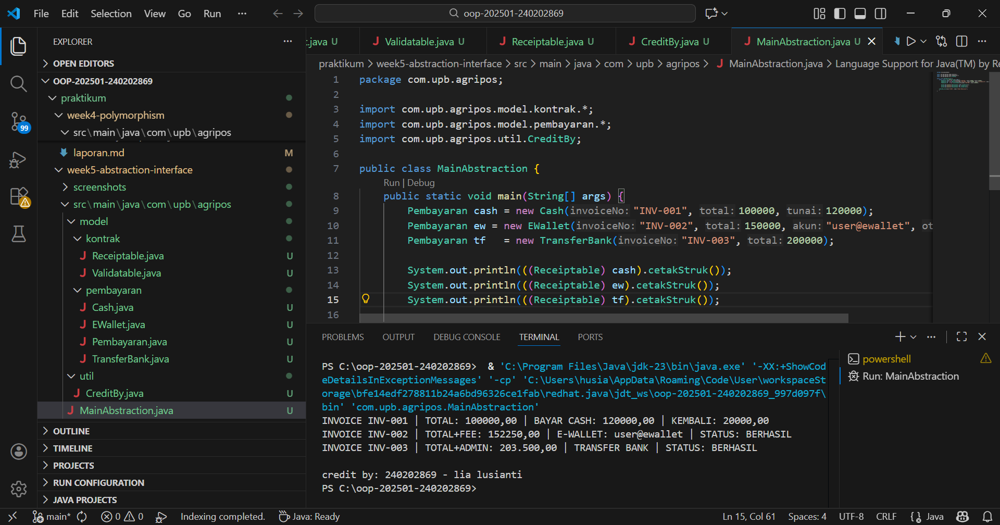

# Laporan Praktikum Minggu 5 
Topik: Abstraction (Abstract Class & Interface)

## Identitas
- Nama  : [Lia Lusianti]
- NIM   : [240202869]
- Kelas : [3IKRB]

---

## Tujuan
- Mahasiswa mampu menjelaskan perbedaan abstract class dan interface.
- Mahasiswa mampu mendesain abstract class dengan method abstrak sesuai kebutuhan kasus.
- Mahasiswa mampu membuat interface dan mengimplementasikannya pada class.
- Mahasiswa mampu menerapkan multiple inheritance melalui interface pada rancangan kelas.
- Mahasiswa mampu mendokumentasikan kode (komentar kelas/method, README singkat pada folder minggu).

---

## Dasar Teori
Abstraksi adalah proses menyederhanakan kompleksitas dengan menampilkan elemen penting dan menyembunyikan detail implementasi.

1. Abstract class: tidak dapat diinstansiasi, dapat memiliki method abstrak (tanpa badan) dan non-abstrak. Dapat menyimpan state (field).
2. Interface: kumpulan kontrak (method tanpa implementasi konkret). Sejak Java 8 mendukung default method. Mendukung multiple inheritance (class dapat mengimplementasikan banyak interface).
3. Gunakan abstract class bila ada shared state dan perilaku dasar; gunakan interface untuk mendefinisikan kemampuan/kontrak lintas hierarki.

Dalam konteks Agri-POS, Pembayaran dapat dimodelkan sebagai abstract class dengan method abstrak prosesPembayaran() dan biaya(). Implementasi konkritnya: Cash dan EWallet. Kemudian, interface seperti Validatable (mis. verifikasi OTP) dan Receiptable (mencetak bukti) dapat diimplementasikan oleh jenis pembayaran yang relevan.
---

## Langkah Praktikum

1. Abstract Class – Pembayaran
- Buat Pembayaran (abstract) dengan field invoiceNo, total dan method:
  - double biaya() (abstrak) → biaya tambahan (fee).
  - boolean prosesPembayaran() (abstrak) → mengembalikan status berhasil/gagal.
  - double totalBayar() (konkrit) → return total + biaya();.
2. Subclass Konkret
- Cash → biaya = 0, proses = selalu berhasil jika tunai >= totalBayar().
- EWallet → biaya = 1.5% dari total; proses = membutuhkan validasi.
3. Interface
- Validatable → boolean validasi(); (contoh: OTP).
- Receiptable → String cetakStruk();
4. Multiple Inheritance via Interface
- EWallet mengimplementasikan dua interface: Validatable, Receiptable.
- Cash setidaknya mengimplementasikan Receiptable.
5. Main Class
- Buat MainAbstraction.java untuk mendemonstrasikan pemakaian Pembayaran (polimorfik).
- Tampilkan hasil proses dan struk. Di akhir, panggil CreditBy.print("[NIM]", "[Nama]").
6. Commit dan Push
- Commit dengan pesan: week5-abstraction-interface.
---

## Kode Program
Pembayaran.java (abstract)
```java
package com.upb.agripos.model.pembayaran;

public abstract class Pembayaran {
    protected String invoiceNo;
    protected double total;

    public Pembayaran(String invoiceNo, double total) {
        this.invoiceNo = invoiceNo;
        this.total = total;
    }

    public abstract double biaya();               // fee/biaya tambahan
    public abstract boolean prosesPembayaran();   // proses spesifik tiap metode

    public double totalBayar() {
        return total + biaya();
    }

    public String getInvoiceNo() { return invoiceNo; }
    public double getTotal() { return total; }
}
```

Cash.java (extends Pembayaran, implements Receiptable)
```java
package com.upb.agripos.model.pembayaran;

import com.upb.agripos.model.kontrak.Receiptable;

public class Cash extends Pembayaran implements Receiptable {
    private double tunai;

    public Cash(String invoiceNo, double total, double tunai) {
        super(invoiceNo, total);
        this.tunai = tunai;
    }

    @Override
    public double biaya() {
        return 0.0;
    }

    @Override
    public boolean prosesPembayaran() {
        return tunai >= totalBayar(); // sederhana: cukup uang tunai
    }

    @Override
    public String cetakStruk() {
        return String.format("INVOICE %s | TOTAL: %.2f | BAYAR CASH: %.2f | KEMBALI: %.2f",
                invoiceNo, totalBayar(), tunai, Math.max(0, tunai - totalBayar()));
    }
}
```

EWallet.java (extends Pembayaran, implements Validatable & Receiptable)
```java
package com.upb.agripos.model.pembayaran;

import com.upb.agripos.model.kontrak.Validatable;
import com.upb.agripos.model.kontrak.Receiptable;

public class EWallet extends Pembayaran implements Validatable, Receiptable {
    private String akun;
    private String otp; // sederhana untuk simulasi

    public EWallet(String invoiceNo, double total, String akun, String otp) {
        super(invoiceNo, total);
        this.akun = akun;
        this.otp = otp;
    }

    @Override
    public double biaya() {
        return total * 0.015; // 1.5% fee
    }

    @Override
    public boolean validasi() {
        return otp != null && otp.length() == 6; // contoh validasi sederhana
    }

    @Override
    public boolean prosesPembayaran() {
        return validasi(); // jika validasi lolos, anggap berhasil
    }

    @Override
    public String cetakStruk() {
        return String.format("INVOICE %s | TOTAL+FEE: %.2f | E-WALLET: %s | STATUS: %s",
                invoiceNo, totalBayar(), akun, prosesPembayaran() ? "BERHASIL" : "GAGAL");
    }
}
```

Interface: Validatable & Receiptable
validatable
```java
package com.upb.agripos.model.kontrak;

public interface Validatable {
    boolean validasi(); // misal validasi OTP/ PIN
}
```
reciptable
```java
package com.upb.agripos.model.kontrak;

public interface Receiptable {
    String cetakStruk();
}
```

MainAbstraction.java
```java
package com.upb.agripos;

import com.upb.agripos.model.pembayaran.*;
import com.upb.agripos.model.kontrak.*;
import com.upb.agripos.util.CreditBy;

public class MainAbstraction {
    public static void main(String[] args) {
        Pembayaran cash = new Cash("INV-001", 100000, 120000);
        Pembayaran ew = new EWallet("INV-002", 150000, "user@ewallet", "123456");

        System.out.println(((Receiptable) cash).cetakStruk());
        System.out.println(((Receiptable) ew).cetakStruk());

    CreditBy.print("[NIM]", "[Nama Mahasiswa]");
    }
}
```

CreditBy.java
```java
package com.upb.agripos.util;

public class CreditBy {
    public static void print(String nim, String nama) {
        System.out.println("\ncredit by: " + 240202869 + " - " + "lia lusianti");
    }
}
```
---

## Hasil Eksekusi 



---

## Analisis
1. Cara kerja kode
Program dimulai dari class MainAbstraction yang berfungsi sebagai entry point. Pada class ini dibuat beberapa objek pembayaran menggunakan tipe referensi Pembayaran, seperti Cash, EWallet, dan metode pembayaran lain yang ditambahkan. Setiap objek pembayaran memanfaatkan class abstrak Pembayaran untuk menyimpan atribut umum seperti nomor invoice dan total pembayaran.
Interface Receiptable digunakan untuk mencetak struk pembayaran melalui method cetakStruk(), sedangkan interface Validatable digunakan untuk melakukan validasi data pembayaran sebelum diproses. Pemanggilan method dilakukan secara polymorphism, di mana objek bertipe Pembayaran dapat memanggil perilaku yang diimplementasikan oleh class turunannya masing-masing. Hasil akhir program menampilkan struk pembayaran di terminal sesuai dengan jenis metode pembayaran yang digunakan.

2. Perbedaan pendekatan dengan minggu sebelumnya
Pada praktikum minggu sebelumnya, program masih berfokus pada penggunaan class dan object secara langsung tanpa pemisahan tanggung jawab yang jelas. Setiap class cenderung berdiri sendiri dan belum menggunakan kontrak perilaku.
Pada minggu ini, pendekatan abstraction dan interface digunakan untuk memisahkan antara struktur umum dan implementasi detail. Class abstrak digunakan sebagai kerangka dasar, sedangkan interface memastikan setiap class turunan mengimplementasikan method tertentu. Pendekatan ini membuat program lebih fleksibel, modular, dan mudah dikembangkan.

3. Kendala yang dihadapi dan cara mengatasinya
Kendala yang sering muncul adalah error package tidak terdeteksi dan class tidak dikenali oleh compiler. Masalah ini terjadi karena perbedaan penulisan nama package (huruf besar dan kecil) serta struktur folder yang tidak sesuai dengan deklarasi package di dalam file Java.
Solusi yang dilakukan adalah memastikan nama package konsisten, memperbaiki struktur folder sesuai dengan package, serta melakukan rebuild project. Selain itu, kendala lain adalah kesalahan import interface dan casting object, yang diatasi dengan memastikan class mengimplementasikan interface yang sesuai sebelum dilakukan pemanggilan method.
---

## Kesimpulan
*Dengan menerapkan konsep abstraction dan interface, program menjadi lebih terstruktur, fleksibel, dan mudah dikembangkan. Penggunaan class abstrak sebagai kerangka dasar serta interface sebagai kontrak perilaku memungkinkan penerapan polymorphism secara optimal. Pendekatan ini memudahkan penambahan metode pembayaran baru tanpa mengubah struktur utama program dan meningkatkan kualitas desain perangkat lunak sesuai prinsip Object-Oriented Programming.*
---

## Quiz
1. Jelaskan perbedaan konsep dan penggunaan abstract class dan interface.
**Jawaban**: Abstract class digunakan sebagai kelas dasar yang merepresentasikan konsep umum dan dapat memiliki atribut (field), method konkret, serta method abstrak. Abstract class cocok digunakan ketika terdapat kesamaan struktur dan perilaku pada beberapa subclass.
Interface digunakan sebagai kontrak perilaku yang harus diimplementasikan oleh class tanpa mempedulikan bagaimana implementasinya. Interface tidak menyimpan state (atribut instance) dan fokus pada kemampuan atau peran yang dimiliki oleh suatu class.
2. Mengapa multiple inheritance lebih aman dilakukan dengan interface pada Java?
**Jawaban**: Multiple inheritance lebih aman menggunakan interface karena interface tidak memiliki implementasi method yang kompleks maupun atribut state, sehingga tidak menimbulkan konflik implementasi seperti diamond problem. Java membatasi pewarisan class hanya satu, tetapi mengizinkan implementasi banyak interface untuk menjaga konsistensi, kejelasan perilaku, dan menghindari ambiguitas dalam eksekusi method.
3. Pada contoh Agri-POS, bagian mana yang paling tepat menjadi abstract class dan mana yang menjadi interface? Jelaskan alasannya.
**Jawaban**: Class Pembayaran paling tepat dijadikan abstract class karena memiliki atribut dan perilaku umum yang dimiliki semua metode pembayaran, seperti nomor invoice, total pembayaran, dan perhitungan total bayar.
Interface Validatable dan Receiptable paling tepat dijadikan interface karena merepresentasikan kemampuan atau peran tambahan, seperti validasi data dan pencetakan struk, yang tidak selalu dimiliki semua metode pembayaran. Dengan pendekatan ini, setiap metode pembayaran dapat memilih kemampuan yang dibutuhkan tanpa bergantung pada struktur class tertentu.
