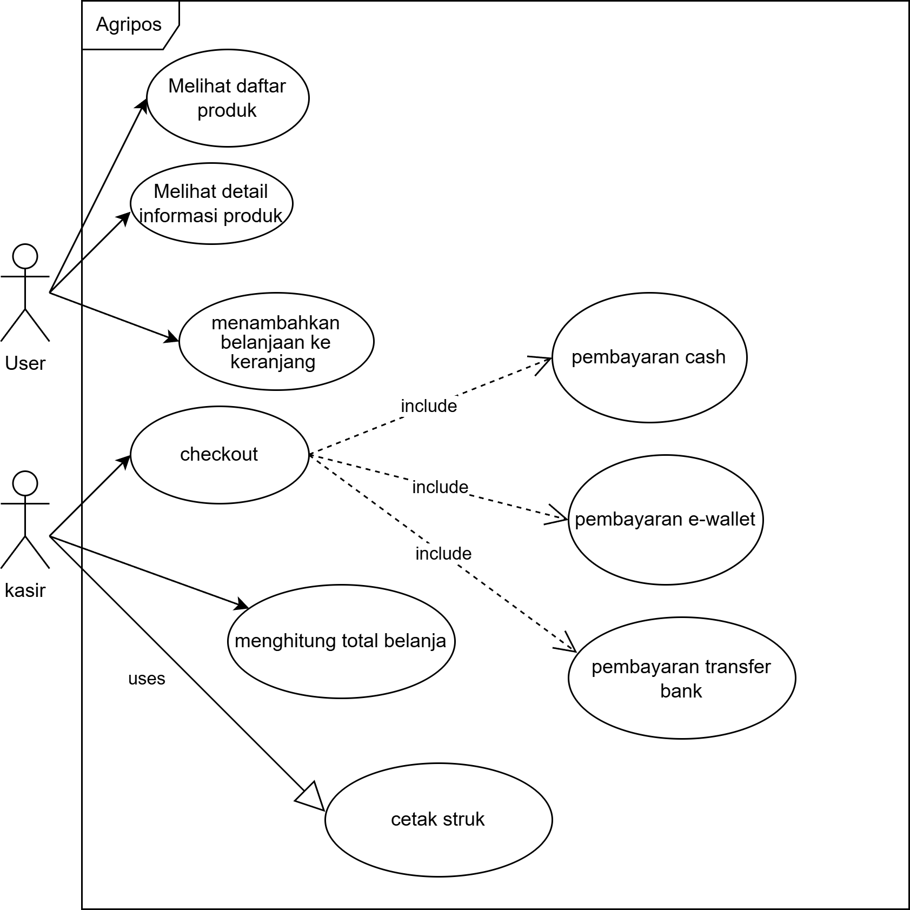
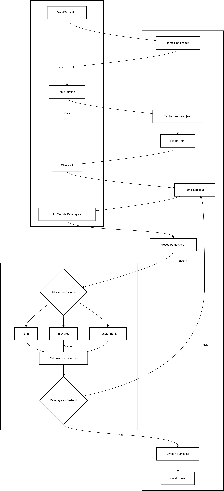
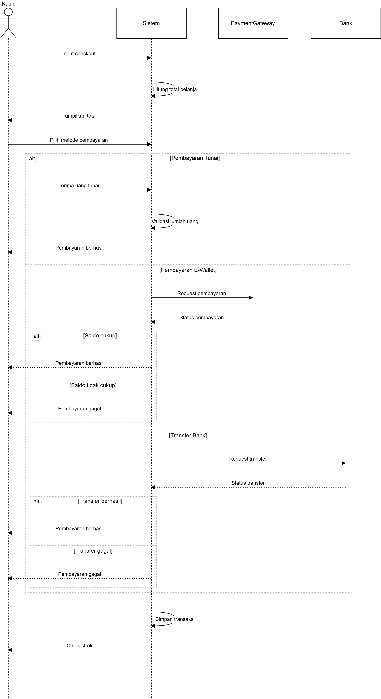
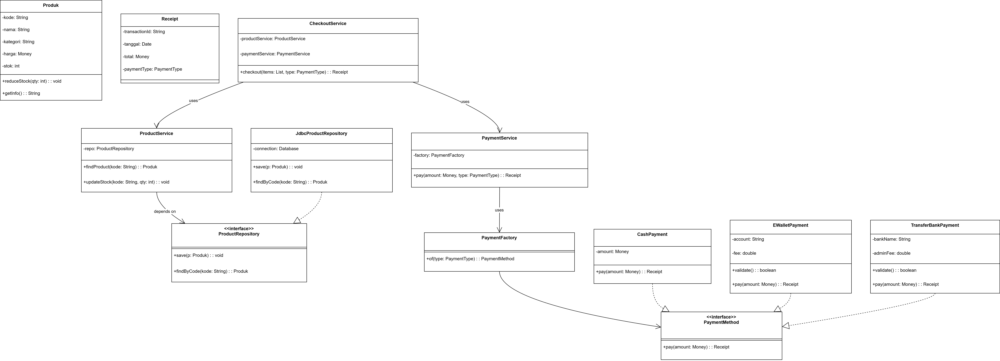

# Laporan Praktikum Minggu 6 
Topik: Desain Arsitektur Sistem dengan UML dan Prinsip SOLID

## Identitas
- Nama  : [Lia Lusianti]
- NIM   : [240202869]
- Kelas : [3IKRB]

---

## Tujuan
- Mahasiswa mampu mengidentifikasi kebutuhan sistem ke dalam diagram UML.
- Mahasiswa mampu menggambar UML Class Diagram dengan relasi antar class yang tepat.
- Mahasiswa mampu menjelaskan prinsip desain OOP (SOLID).
- Mahasiswa mampu menerapkan minimal dua prinsip SOLID dalam kode program.
---

## Dasar Teori
1. Desain arsitektur sistem adalah proses perancangan struktur dasar perangkat lunak agar sistem terorganisir, mudah dikembangkan, dan mudah dipelihara.
2. Unified Modeling Language (UML) merupakan bahasa pemodelan standar untuk memvisualisasikan dan mendokumentasikan struktur serta perilaku sistem sebelum diimplementasikan.
3. Diagram UML seperti Use Case, Class, Sequence, dan Activity Diagram membantu menggambarkan fungsi, struktur, dan alur interaksi sistem secara jelas.
4. Prinsip SOLID adalah lima prinsip desain berorientasi objek yang bertujuan meningkatkan kualitas, fleksibilitas, dan keterpeliharaan sistem.
5. Kombinasi UML dan prinsip SOLID menghasilkan desain arsitektur sistem yang terstruktur, modular, dan siap dikembangkan dalam jangka panjang.

---

## Langkah Praktikum
- Melakukan persiapan environment dengan membuka project menggunakan editor/IDE dan memastikan Git sudah terpasang serta repository sudah terhubung ke GitHub.
- Menyusun struktur folder praktikum sesuai dengan ketentuan minggu praktikum yang dikerjakan.
- Membuat dan menuliskan source code Java sesuai dengan materi praktikum.
- Menjalankan program untuk memastikan kode dapat dieksekusi tanpa error.
- Mendokumentasikan hasil eksekusi program dalam bentuk screenshot.
- Menyimpan laporan praktikum ke dalam file laporan.md.
- Melakukan pengecekan status perubahan file menggunakan perintah git status.
- Menambahkan file yang telah dibuat atau diubah ke staging area menggunakan git add.
- Melakukan commit dengan pesan yang sesuai dengan materi praktikum.
- Mengunggah hasil praktikum ke repository GitHub menggunakan git push.

---

## Diagram UML dan Penjelasannya
1. **Use Case Diagram: Sistem Agripos**
Diagram Use Case ini menggambarkan interaksi antara aktor eksternal dengan sistem Agripos. Terdapat dua aktor utama, yaitu User (pelanggan) dan Kasir.

Aktor User: Berinteraksi dengan sistem untuk fungsionalitas pra-transaksi, seperti melihat daftar produk, melihat detail informasi produk, dan memasukkan produk ke dalam keranjang belanja.

Aktor Kasir: Bertanggung jawab atas proses transaksi inti. Fungsi Checkout memiliki relasi <<include>> ke berbagai metode pembayaran (Cash, E-Wallet, dan Transfer Bank), yang berarti proses pembayaran adalah bagian wajib dari checkout. Selain itu, Kasir mengelola penghitungan total belanja dan pencetakan struk (dengan relasi <<uses>>).

Tujuan: Diagram ini memastikan batasan sistem jelas, di mana pemisahan tugas antara konsumen dan staf operasional terdefinisi dengan baik.

2. **Activity Diagram: Proses Checkout**
Activity Diagram ini memetakan alur kerja operasional mulai dari awal transaksi hingga pencetakan struk, yang melibatkan koordinasi antara Kasir, Sistem, dan Payment Gateway.

Alur Utama: Proses dimulai dari pemindaian produk oleh kasir, kemudian sistem secara otomatis menghitung total harga dan menampilkannya.

Logika Keputusan (Decision): Terdapat percabangan pada metode pembayaran. Sistem akan memproses validasi berdasarkan pilihan (Tunai, E-Wallet, atau Bank).

Mekanisme Feedback: Jika pembayaran gagal, sistem akan mengarahkan kembali ke tampilan total belanja. Jika berhasil (Ya), sistem akan menyimpan data transaksi secara permanen ke database dan diakhiri dengan pencetakan struk sebagai bukti sah transaksi.

3. **Sequence Diagram: Mekanisme Pembayaran**
Sequence Diagram ini memberikan gambaran detail mengenai urutan pesan dan interaksi antar objek (Kasir, Sistem, PaymentGateway, dan Bank) dalam satu rentang waktu proses pembayaran.

Interaksi Objek: Diagram ini menunjukkan bagaimana CheckoutService memvalidasi input dari Kasir dan melakukan koordinasi dengan entitas eksternal seperti PaymentGateway untuk e-wallet atau Bank untuk transfer.

Fragment Alt (Alternative): Penggunaan blok alt menunjukkan penanganan skenario logis yang berbeda dalam kode program, seperti kondisi ketika saldo cukup (pembayaran berhasil) versus saldo tidak cukup (pembayaran gagal). Ini menggambarkan aspek dinamis dari sistem saat menangani berbagai kondisi respons dari pihak ketiga.

4. **Class Diagram: Arsitektur Perangkat Lunak**
Class Diagram ini menunjukkan struktur statis dari sistem Agripos dengan menerapkan prinsip-prinsip SOLID untuk memastikan kode yang bersih dan mudah dirawat.

Penerapan Dependency Inversion Principle (DIP): Hal ini terlihat pada ProductService yang tidak bergantung langsung pada implementasi database (JdbcProductRepository), melainkan pada antarmuka (interface) ProductRepository. Hal ini memudahkan pengujian (testability) karena repositori dapat dengan mudah diganti dengan mock object.

Penerapan Open/Closed Principle (OCP): Desain pembayaran menggunakan interface PaymentMethod. Jika sistem ingin menambah metode pembayaran baru (misalnya: Qris atau Paylater), kita cukup membuat kelas baru yang mengimplementasikan interface tersebut tanpa perlu mengubah kode yang sudah ada di PaymentService atau PaymentFactory.

Hubungan Antar Kelas: Diagram menunjukkan hubungan ketergantungan (Dependency) dan realisasi (Implementation) yang rapi, memisahkan antara entitas data (Produk, Receipt) dengan logika bisnis (CheckoutService).

| Functional Requirement   | Use Case         | Activity / Sequence    | Class / Interface                                  |
| ------------------------ | ---------------- | ---------------------- | -------------------------------------------------- |
| Manajemen Produk         | UC-Kelola Produk | Activity Produk        | Produk, ProductService, ProductRepository          |
| Checkout                 | UC-Checkout      | Activity Checkout      | CheckoutService, Produk                            |
| Pembayaran Tunai         | UC-Checkout      | Sequence Cash Payment  | PaymentMethod, CashPayment, PaymentService         |
| Pembayaran E-Wallet      | UC-Checkout      | Sequence E-Wallet      | PaymentMethod, EWalletPayment, PaymentService      |
| Pembayaran Transfer Bank | UC-Checkout      | Sequence Transfer Bank | PaymentMethod, TransferBankPayment, PaymentService |

---

## Hasil Eksekusi

---

## Analisis
1. Bagaimana Kode Berjalan
- Inisiasi Transaksi: Kasir memulai proses melalui CheckoutService untuk memproses daftar belanjaan.
- Validasi Stok: Sistem berinteraksi dengan ProductService untuk mengecek ketersediaan barang melalui ProductRepository.
- Alur Pembayaran: Jika menggunakan metode non-tunai, sistem melakukan komunikasi dengan PaymentGateway atau Bank dan menunggu status validasi (berhasil/gagal).
- Finalisasi: Setelah pembayaran terverifikasi, sistem memperbarui stok barang, menyimpan transaksi, dan mengeluarkan objek Receipt untuk mencetak struk.

2. Perbedaan Pendekatan Minggu Ini
- Abstraksi vs Konkret: Minggu ini menggunakan Interface (seperti PaymentMethod), sehingga kelas utama tidak lagi bergantung pada implementasi detail (DIP).
- Modularitas: Penambahan fitur baru (seperti metode pembayaran Qris) dapat dilakukan tanpa mengubah kode yang sudah ada, sesuai prinsip Open/Closed.
- Pemisahan Tanggung Jawab: Logika akses database dipisahkan ke dalam Repository, sehingga kode bisnis lebih bersih dan terorganisir.

3. Kendala dan Solusi
- Kendala: Kebingungan dalam menentukan kapan harus menggunakan relasi Aggregation atau Composition pada Class Diagram.
- Solusi: Melakukan analisis siklus hidup objek; jika objek bagian harus musnah saat induk dihapus, maka digunakan Composition (seperti Keranjang dan Item).
- Kendala: Error saat memanggil gambar di file Markdown GitHub.
- Solusi: Memperbaiki path menjadi Relative Path (contoh: docs/nama_gambar.png) dan memastikan nama file sesuai dengan case-sensitivity.
---

## Kesimpulan
- Efisiensi Perancangan: Penggunaan UML Terbukti membantu dalam memetakan logika sistem Agripos secara visual sebelum tahap implementasi kode dimulai.
- Kualitas Kode: Penerapan prinsip SOLID (khususnya OCP dan DIP) membuat sistem menjadi lebih fleksibel dan mudah untuk dilakukan unit testing.
- Dokumentasi Terintegrasi: Penyusunan folder yang rapi (docs/, src/, screenshots/) sangat memudahkan kolaborasi dan proses deployment ke platform seperti GitHub.
---

## Quiz
1. Jelaskan perbedaan aggregation dan composition serta berikan contoh penerapannya pada desain Anda. **jawaban:** Dalam perancangan sistem menggunakan UML, perbedaan antara Aggregation (agregasi) dan Composition (komposisi) terletak pada kekuatan hubungan dan ketergantungan siklus hidup antar objek. Agregasi merepresentasikan hubungan "milik" yang bersifat lemah, di mana objek bagian dapat berdiri sendiri meskipun objek induknya dihapus. Contohnya pada desain sistem akademik, hubungan antara Jurusan dan Dosen adalah agregasi; jika sebuah jurusan dihapus, dosen tetap ada sebagai entitas mandiri. Sebaliknya, komposisi merepresentasikan hubungan kepemilikan yang sangat kuat, di mana objek bagian tidak dapat hidup tanpa objek induknya. Sebagai contoh, hubungan antara Rumah dan Kamar; jika objek rumah dihapus, maka secara logis kamar di dalamnya juga akan ikut terhapus karena kamar merupakan bagian integral yang tidak terpisahkan dari struktur rumah tersebut.
2. Bagaimana prinsip Open/Closed dapat memastikan sistem mudah dikembangkan? **jaaban:** Prinsip Open/Closed memastikan sistem mudah dikembangkan dengan menetapkan aturan bahwa entitas perangkat lunak harus terbuka untuk perluasan (open for extension) namun tertutup untuk modifikasi (closed for modification). Dalam praktiknya, prinsip ini memungkinkan pengembang untuk menambah fitur-fitur baru hanya dengan membuat kelas-kelas baru yang mengimplementasikan antarmuka (interface) atau mewarisi kelas abstrak yang sudah ada, tanpa harus membongkar kode sumber yang sudah berjalan. Hal ini sangat menguntungkan dalam pengelolaan proyek jangka panjang karena dapat mencegah terjadinya efek samping atau bug baru pada modul yang sudah stabil, sehingga proses pemeliharaan dan skalabilitas sistem menjadi lebih aman dan efisien.
3. Mengapa Dependency Inversion Principle (DIP) meningkatkan testability? Berikan contoh penerapannya. **jawaban:** Dependency Inversion Principle (DIP) secara signifikan meningkatkan fleksibilitas pengujian (testability) dengan cara memutus ketergantungan langsung antara modul tingkat tinggi dan modul tingkat rendah. Melalui penerapan DIP, kelas-kelas tidak lagi bergantung pada implementasi konkret, melainkan pada abstraksi atau interface. Hal ini memungkinkan pengembang untuk mengganti implementasi asli (seperti koneksi database atau API pihak ketiga) dengan Mock Objects atau objek tiruan selama proses pengujian. Dengan demikian, unit testing dapat dilakukan secara terisolasi tanpa memerlukan infrastruktur nyata yang kompleks, sehingga proses verifikasi logika program menjadi lebih cepat, konsisten, dan tidak bergantung pada faktor eksternal.