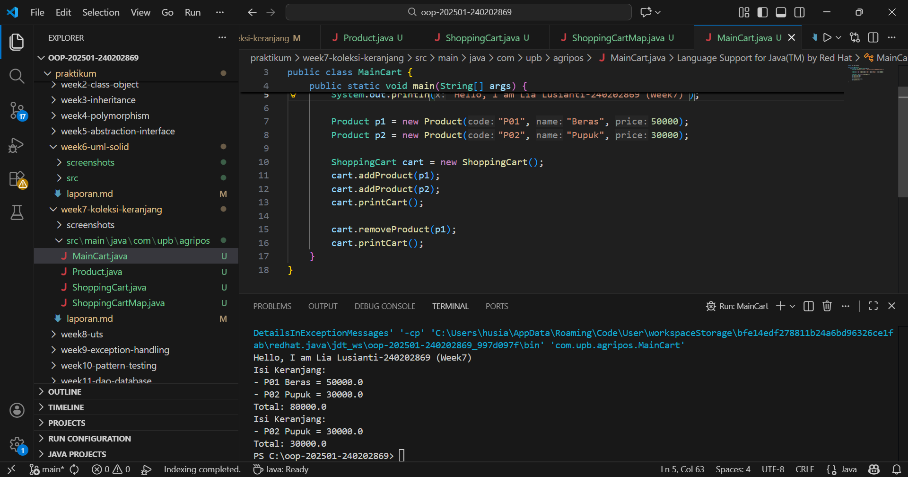

# Laporan Praktikum Minggu 7
Topik: [Collections dan Implementasi Keranjang Belanja]

## Identitas
- Nama  : [Lia Lusianti]
- NIM   : [240202869]
- Kelas : [3IKRB]

---

## Tujuan
- Menjelaskan konsep collection dalam Java (List, Map, Set).
- Menggunakan ArrayList untuk menyimpan dan mengelola objek.
- Mengimplementasikan Map atau Set sesuai kebutuhan pengelolaan data.
- Melakukan operasi dasar pada collection: tambah, hapus, dan hitung total.
- Menganalisis efisiensi penggunaan collection dalam konteks sistem Agri-POS.

---

## Dasar Teori
1. Collections Framework
Java Collections Framework menyediakan struktur data untuk mengelola objek secara dinamis dan efisien.

Struktur utama:
- List (implementasi: ArrayList) — Terurut, dapat menyimpan elemen duplikat.
- Map (implementasi: HashMap) — Menyimpan pasangan key–value, akses cepat berdasarkan key.
- Set (implementasi: HashSet) — Tidak menerima duplikat dan tidak mempertahankan urutan.

2. Studi Kasus: Keranjang Belanja Agri-POS
Keranjang belanja harus dapat:
- Menambahkan produk
- Menghapus produk
- Menampilkan isi keranjang
- Menghitung total nilai transaksi
- Menangani jumlah (quantity) menggunakan Map
- Kasus ini mencerminkan penggunaan struktur data dalam aplikasi nyata seperti POS.
---

## Langkah Praktikum
1.Persiapan dan Setup Proyek

- Membuka proyek Java dengan struktur direktori praktikum/week7-collections.
- Memastikan package utama menggunakan com.upb.agripos.
- Menyiapkan folder:
- src/main/java/com/upb/agripos
- screenshots
- laporan_week7.md

2. Pembuatan Class Product

- Membuat class Product untuk merepresentasikan data produk.
- Menentukan atribut:
- code (kode produk)
- name (nama produk)
- price (harga produk)
- Membuat constructor dan method getter.
- File yang dibuat:
- Product.java

3. Implementasi Keranjang Belanja Menggunakan ArrayList

- Membuat class ShoppingCart.
- Menggunakan ArrayList<Product> untuk menyimpan daftar produk.
- Mengimplementasikan method:
- addProduct() → menambahkan produk ke keranjang
- removeProduct() → menghapus produk dari keranjang
- getTotal() → menghitung total harga belanja
- printCart() → menampilkan isi keranjang dan total belanja
- File yang dibuat:
- ShoppingCart.java

4. Implementasi Keranjang Belanja Menggunakan Map (Alternatif)

- Membuat class ShoppingCartMap.
- Menggunakan Map<Product, Integer> untuk menyimpan produk beserta jumlahnya.
- Mengimplementasikan method:
- addProduct() → menambah jumlah produk
- removeProduct() → mengurangi atau menghapus produk
- getTotal() → menghitung total harga berdasarkan jumlah
- printCart() → menampilkan isi keranjang
- File yang dibuat:
- ShoppingCartMap.java

5. Pembuatan Main Program

- Membuat class MainCart sebagai program utama.
- Membuat beberapa objek Product.
- Menambahkan dan menghapus produk dari keranjang.
- Menjalankan program untuk memastikan seluruh method berjalan dengan benar.
- File yang dibuat:
- MainCart.java

6. Menjalankan Program dan Dokumentasi

- Menjalankan program melalui MainCart.
- Memastikan output menampilkan:
- Isi keranjang
- Total belanja
- Perubahan setelah produk dihapus
- Mengambil screenshot hasil eksekusi dan menyimpannya ke folder screenshots/hasil.png.

7. Commit dan Push ke GitHub

- Menambahkan seluruh file ke staging area.
- Melakukan commit sesuai format yang ditentukan.
- Melakukan push ke repository GitHub.
- Commit message yang digunakan:

---

## Kode Program
Class Product
```java
package com.upb.agripos;

public class Product {
    private final String code;
    private final String name;
    private final double price;

    public Product(String code, String name, double price) {
        this.code = code;
        this.name = name;
        this.price = price;
    }

    public String getCode() { return code; }
    public String getName() { return name; }
    public double getPrice() { return price; }
}
```

ShoppingCart 
```java
package com.upb.agripos;

import java.util.ArrayList;

public class ShoppingCart {
    private final ArrayList<Product> items = new ArrayList<>();

    public void addProduct(Product p) { items.add(p); }
    public void removeProduct(Product p) { items.remove(p); }

    public double getTotal() {
        double sum = 0;
        for (Product p : items) {
            sum += p.getPrice();
        }
        return sum;
    }

    public void printCart() {
        System.out.println("Isi Keranjang:");
        for (Product p : items) {
            System.out.println("- " + p.getCode() + " " + p.getName() + " = " + p.getPrice());
        }
        System.out.println("Total: " + getTotal());
    }
}
```

ShoppingCartMap
```java
package com.upb.agripos;

import java.util.HashMap;
import java.util.Map;

public class ShoppingCartMap {
    private final Map<Product, Integer> items = new HashMap<>();

    public void addProduct(Product p) { items.put(p, items.getOrDefault(p, 0) + 1); }

    public void removeProduct(Product p) {
        if (!items.containsKey(p)) return;
        int qty = items.get(p);
        if (qty > 1) items.put(p, qty - 1);
        else items.remove(p);
    }

    public double getTotal() {
        double total = 0;
        for (Map.Entry<Product, Integer> entry : items.entrySet()) {
            total += entry.getKey().getPrice() * entry.getValue();
        }
        return total;
    }

    public void printCart() {
        System.out.println("Isi Keranjang (Map):");
        for (Map.Entry<Product, Integer> e : items.entrySet()) {
            System.out.println("- " + e.getKey().getCode() + " " + e.getKey().getName() + " x" + e.getValue());
        }
        System.out.println("Total: " + getTotal());
    }
}
```

MainCart
```java
package com.upb.agripos;

public class MainCart {
    public static void main(String[] args) {
        System.out.println("Hello, I am Lia Lusianti-240202869 (Week7)");

        Product p1 = new Product("P01", "Beras", 50000);
        Product p2 = new Product("P02", "Pupuk", 30000);

        ShoppingCart cart = new ShoppingCart();
        cart.addProduct(p1);
        cart.addProduct(p2);
        cart.printCart();

        cart.removeProduct(p1);
        cart.printCart();
    }
}
```
---

## Hasil Eksekusi



---

## Analisis
1. Alur kerja program
- Program dimulai dengan pembuatan objek Product yang merepresentasikan data produk (kode, nama, dan harga).
- Objek Product dimasukkan ke dalam keranjang belanja menggunakan method addProduct.
- Data produk disimpan menggunakan collection (ArrayList atau Map) sehingga jumlah item dapat bertambah atau berkurang secara dinamis.
- Method removeProduct digunakan untuk menghapus produk dari keranjang.
- Method getTotal / hitungTotal menjumlahkan harga seluruh produk di dalam keranjang.
- Method printCart menampilkan isi keranjang dan total belanja ke console.

2. Perbedaan pendekatan minggu ini dengan minggu sebelumnya
- Week 1–6:
- Fokus pada konsep dasar OOP seperti class, object, inheritance, polymorphism, abstraction, dan interface.
- Struktur data masih sederhana dan belum menggunakan koleksi secara intensif.

- Week 7:
- Fokus pada penggunaan Java Collection Framework (ArrayList dan Map).
- Program mampu mengelola banyak objek produk secara dinamis.
- Pendekatan Map memungkinkan pengelolaan quantity (jumlah produk) dalam keranjang.

3. Kendala yang dihadapi
- Masih membedakan penggunaan ArrayList dan Map untuk kasus keranjang belanja.
- Perhitungan total harga ketika produk lebih dari satu atau memiliki jumlah berbeda.
- Penghapusan produk dari keranjang ketika data sudah tersimpan dalam koleksi.

4. Cara mengatasi kendala
- Mempelajari konsep dasar ArrayList dan Map dari dokumentasi Java.
- Melakukan pengujian bertahap pada setiap method (addProduct, removeProduct, getTotal).
- Menampilkan hasil ke console untuk memastikan data sesuai dengan yang diharapkan.
---

## Kesimpulan
- Penggunaan collection pada Java mempermudah pengelolaan data produk dalam jumlah banyak.
- Keranjang belanja menjadi lebih fleksibel karena produk dapat ditambah dan dihapus secara dinamis.
- Program menjadi lebih terstruktur dan siap dikembangkan ke fitur lanjutan seperti checkout dan pembayaran.
- Implementasi ini mendukung pengembangan sistem Agri-POS secara bertahap dan berkelanjutan.
---

## Quiz
1. Jelaskan perbedaan mendasar antara List, Map, dan Set. **jawaban:** 
List: Koleksi terurut yang mengizinkan duplikasi data (diakses lewat indeks).
Set: Koleksi tidak terurut yang melarang duplikasi (setiap data harus unik).
Map: Koleksi berpasangan Key-Value; akses data dilakukan melalui Key yang unik.
2. Mengapa ArrayList cocok digunakan untuk keranjang belanja sederhana? **jawaban:** Karena ArrayList mampu menjaga urutan barang yang dimasukkan dan mengizinkan duplikasi (misal: memasukkan dua kotak susu yang sama sebagai item terpisah), serta ukurannya dinamis.
3. Bagaimana struktur Set mencegah duplikasi data? **jawaban:** Menggunakan mekanisme Hashing. Saat data dimasukkan, sistem mengecek hash code (kode unik) dan membandingkannya dengan data yang sudah ada. Jika sudah ada yang identik, data baru akan ditolak.
4. Kapan sebaiknya menggunakan Map dibandingkan List? Jelaskan dengan contoh. **jawaban** Map vs List Gunakan Map saat Anda perlu mencari data berdasarkan label/ID spesifik agar lebih cepat (pencarian instan).

Contoh: Daripada mencari profil "Budi" di dalam List berisi ribuan nama (lambat), lebih baik gunakan Map dengan Key berupa nomor NIK (cepat/langsung ketemu).
