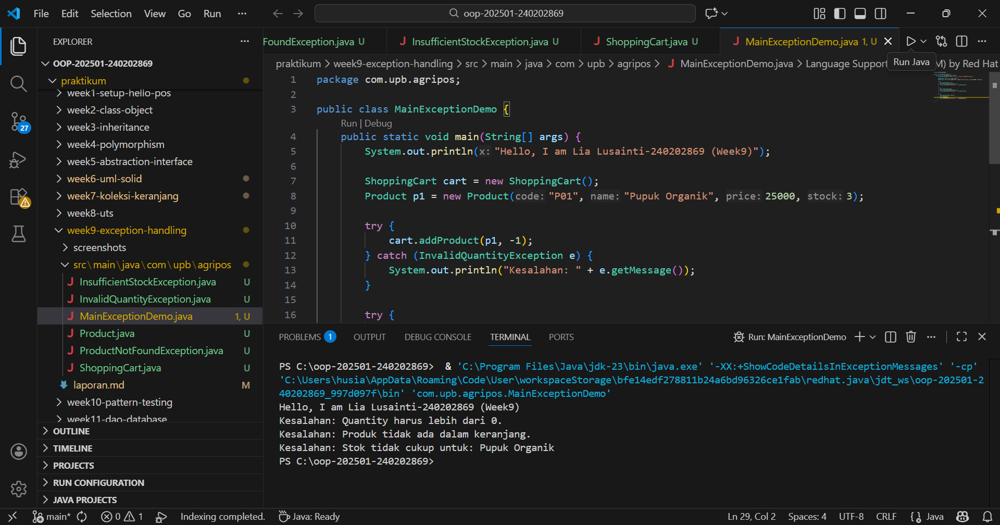

# Laporan Praktikum Minggu 9 (sesuaikan minggu ke berapa?)
Topik: Exception Handling, Custom Exception, dan Penerapan Design Pattern

## Identitas
- Nama  : [Lia Lusianti]
- NIM   : [240202869]
- Kelas : [3IKRB]

---

## Tujuan
- Menjelaskan perbedaan antara error dan exception.
- Mengimplementasikan try–catch–finally dengan tepat.
- Membuat custom exception sesuai kebutuhan program.
- Mengintegrasikan exception handling ke dalam aplikasi sederhana (kasus keranjang belanja).
- (Opsional) Menerapkan design pattern sederhana (Singleton/MVC) dan unit testing dasar.


---

## Dasar Teori
1. Error vs Exception
Error → kondisi fatal, tidak dapat ditangani (contoh: OutOfMemoryError).
Exception → kondisi tidak normal yang dapat ditangani oleh program.
2. Struktur try–catch–finally
try {
    // kode yang berpotensi menimbulkan kesalahan
} catch (Exception e) {
    // penanganan
} finally {
    // blok yang selalu dijalankan
}
3. Membuat Custom Exception
package com.upb.agripos;

public class InvalidQuantityException extends Exception {
    public InvalidQuantityException(String message) {
        super(message);
    }
}

---

## Langkah Praktikum
1. membuat custom exception 
2. model product dengan stok
3. impelemntasi Shoppingcart dengan exception handling
4. main program untuk menguji exception handling

---

## Kode Program 

InsufficientStockException
```java
package com.upb.agripos;

public class InsufficientStockException extends Exception {
    public InsufficientStockException(String msg) { super(msg); }
}
```
InvalidQuantityException
```java 
package com.upb.agripos;

public class InvalidQuantityException extends Exception {
    public InvalidQuantityException(String message) {
        super(message);
    }
}
```

MainExceptionDemo
```java 
package com.upb.agripos;

public class MainExceptionDemo {
    public static void main(String[] args) {
        System.out.println("Hello, I am Lia Lusainti-240202869 (Week9)");

        ShoppingCart cart = new ShoppingCart();
        Product p1 = new Product("P01", "Pupuk Organik", 25000, 3);

        try {
            cart.addProduct(p1, -1);
        } catch (InvalidQuantityException e) {
            System.out.println("Kesalahan: " + e.getMessage());
        }

        try {
            cart.removeProduct(p1);
        } catch (ProductNotFoundException e) {
            System.out.println("Kesalahan: " + e.getMessage());
        }

        try {
            cart.addProduct(p1, 5);
            cart.checkout();
        } catch (Exception e) {
            System.out.println("Kesalahan: " + e.getMessage());
        }
    }
}
```

Product
```java 
package com.upb.agripos;

public class Product {
    private final String code;
    private final String name;
    private final double price;
    private int stock;

    public Product(String code, String name, double price, int stock) {
        this.code = code;
        this.name = name;
        this.price = price;
        this.stock = stock;
    }

    public String getCode() { return code; }
    public String getName() { return name; }
    public double getPrice() { return price; }
    public int getStock() { return stock; }
    public void reduceStock(int qty) { this.stock -= qty; }
}
```

ProductNotFoundException
```java
package com.upb.agripos;

public class ProductNotFoundException extends Exception {
    public ProductNotFoundException(String msg) { super(msg); }
}
```

ShoppingCart
```java
package com.upb.agripos;

import java.util.HashMap;
import java.util.Map;

public class ShoppingCart {
    private final Map<Product, Integer> items = new HashMap<>();

    public void addProduct(Product p, int qty) throws InvalidQuantityException {
        if (qty <= 0) {
            throw new InvalidQuantityException("Quantity harus lebih dari 0.");
        }
        items.put(p, items.getOrDefault(p, 0) + qty);
    }

    public void removeProduct(Product p) throws ProductNotFoundException {
        if (!items.containsKey(p)) {
            throw new ProductNotFoundException("Produk tidak ada dalam keranjang.");
        }
        items.remove(p);
    }

    public void checkout() throws InsufficientStockException {
        for (Map.Entry<Product, Integer> entry : items.entrySet()) {
            Product product = entry.getKey();
            int qty = entry.getValue();
            if (product.getStock() < qty) {
                throw new InsufficientStockException(
                    "Stok tidak cukup untuk: " + product.getName()
                );
            }
        }
        // contoh pengurangan stok bila semua cukup
        for (Map.Entry<Product, Integer> entry : items.entrySet()) {
            entry.getKey().reduceStock(entry.getValue());
        }
    }
}
```
---

## Hasil Eksekusi
(Sertakan screenshot hasil eksekusi program.  

)
---

## Analisis
Pada praktikum minggu ke-9 ini, program dijalankan dengan memanfaatkan mekanisme exception handling untuk menangani berbagai kondisi kesalahan.
Ketika pengguna memasukkan jumlah produk yang tidak valid, program melempar InvalidQuantityException. Saat produk tidak ditemukan di keranjang, ProductNotFoundException akan muncul. Selain itu, pengecekan stok dilakukan sebelum proses checkout menggunakan InsufficientStockException.

Perbedaan utama dibandingkan minggu sebelumnya adalah:
1. Program tidak hanya berfokus pada logika dasar, tetapi juga pada penanganan kesalahan secara eksplisit.
2. Kode menjadi lebih aman karena kesalahan tidak langsung menghentikan program.
3. Penggunaan custom exception membuat pesan kesalahan lebih jelas dan spesifik.
4. Kendala yang dihadapi adalah menentukan kapan exception harus dilempar dan ditangkap. Kendala ini diatasi dengan memahami alur logika program dan memisahkan jenis kesalahan sesuai konteksnya.
---

## Kesimpulan
Berdasarkan praktikum minggu ke-9, dapat disimpulkan bahwa penerapan exception handling dan custom exception membuat program lebih robust, terstruktur, dan mudah dipelihara. Kesalahan dapat ditangani dengan baik tanpa menyebabkan program berhenti secara tiba-tiba, sehingga kualitas aplikasi meningkat.

---

## Quiz
1. **Jelaskan perbedaan error dan exception** **jabawan:** Error adalah kesalahan serius yang terjadi di luar kendali program dan tidak dapat ditangani, misalnya OutOfMemoryError. Error biasanya menyebabkan program berhenti.Exception adalah kondisi kesalahan yang masih dapat ditangani oleh program, seperti kesalahan input, stok tidak cukup, atau data tidak ditemukan.
2. **Apa fungsi finally dalam blok try–catch–finally?**
**jawaban:**
Blok finally berfungsi untuk menjalankan kode yang pasti dieksekusi, baik terjadi exception maupun tidak.
Biasanya digunakan untuk:
- Menutup resource (file, database, koneksi)
- Membersihkan proses
- Menjaga konsistensi program
3. **Mengapa custom exception diperlukan?**
**jawaban:**
Custom exception diperlukan agar:
- Kesalahan dapat ditangani secara spesifik sesuai kebutuhan aplikasi
- Pesan error menjadi lebih jelas dan mudah dipahami pengguna
- Logika bisnis lebih terstruktur dan mudah dipelihara
- Tidak bergantung pada exception umum yang terlalu global
4. **Berikan contoh kasus bisnis dalam POS yang membutuhkan custom exception**
**jawaban:**
Contoh kasus pada sistem Point of Sale (POS):
- InsufficientStockException → ketika kasir menjual barang melebihi stok yang tersedia
- InvalidQuantityException → ketika jumlah pembelian bernilai nol atau negatif
- ProductNotFoundException → ketika produk tidak terdaftar dalam sistem
- InvalidPaymentException → ketika pembayaran kurang dari total belanja
- Custom exception membantu sistem POS memberikan pesan kesalahan yang jelas dan mencegah kesalahan transaksi.